pQBR Plasmids: Experimental Analysis
================

Data analysis for manuscript “The pQBR mercury resistance plasmids: a
model set of sympatric environmental mobile genetic elements”. Code
written by Victoria T Orr (<Victoria.Orr@liverpool.ac.uk>), supervised
by [James P.J. Hall](mailto:j.p.j.hall@liverpool.ac.uk).

Prerequisite file:

- “Hybrid_data.csv” - data collected from conjguation/fitness
  experiments (excluding growth curves)

Functions and colour scheme:

``` r
`%notin%` <- Negate(`%in%`)

pd <- position_dodge(width=0.5)
col1 <- "#FFB000"
col2 <- "#DC267F"
col4 <- "#FE6100"
col3 <- "#785EF0"
col5 <- "#000000"
col6 <- "#0101DF"
col7 <- "#18B6DA"
```

Hybrid_data.csv consists of several datasets collected on different
dates.

For analysis, we aggregated the data from the Dec_24 and Jan_25
experiments, since these were performed just one month apart. We
additionally included the pQBR55 data from Oct_22 as this was the only
dataset for this plasmid, and results for the other plasmids tested
(pP19E3, pQBR57, pQBR103) were consistent with those from later
experiments.

``` r
exp_df <- read.csv("Hybrid_data.csv", header = TRUE, sep = ",", 
                     colClasses = c(rep("factor",6), rep("numeric",14),"factor","factor")) %>%
  mutate(Start_D = 0.01 * (Start_DC*10^(Dilution_S))/Quantity_S,
         Start_R = 0.01 * (Start_RC*10^(Dilution_S))/Quantity_S,
         Start_N = Start_D + Start_R,
         End_D = (End_DC*10^(Dilution_E))/Quantity_E,
         End_R = (End_RC*10^(Dilution_E))/Quantity_E,
         End_N = End_D + End_R)

conj_exp <- exp_df %>%
  filter(!(is.na(Plas_TC))) %>% # remove data without conjugation measurements
  mutate(Plas_T = (Plas_TC*10^(Dilution_P))/Quantity_P,
         Tran_T = (Tran_TC*10^(Dilution_T))/Quantity_T,
         psi = log(End_N/Start_N)/24,
         gamma.p = psi * log(1+((Plas_T/End_R)*(End_N/End_D))) * (1/(End_N-Start_N)),
         gamma.t = psi * log(1+((Tran_T/End_R)*(End_N/End_D))) * (1/(End_N-Start_N)))

# calculate minimal limits

lims <- data.frame(
  Start_N = 0.01 * (125*10^6)/0.05,
  End_N = (100*10^7)/0.05,
  End_D = (36*10^7)/0.05,
  End_R = (64*10^7)/0.05,
  Plas_T = 1*10^2/0.05, # using the least diluted plate, and most plated
  Tran_T = 1*10^0/0.2 # using the least diluted plate, and most plated
) %>% 
  mutate(psi = log(End_N/Start_N)/24,
         gamma.p = psi * log(1+((Plas_T/End_R)*(End_N/End_D))) * (1/(End_N-Start_N)),
         gamma.t = psi * log(1+((Tran_T/End_R)*(End_N/End_D))) * (1/(End_N-Start_N)))

# plot

ggplot(data=conj_exp, aes(x=Plasmid, shape=Plas)) + 
  geom_point(aes(y=log10(gamma.p)), colour="darkred") + 
  geom_point(aes(y=log10(gamma.t)), colour="darkblue") + 
  facet_grid(.~Data) + theme(axis.text.x=element_text(angle=45, hjust=1))
```

    ## Warning: Removed 11 rows containing missing values or values outside the scale range
    ## (`geom_point()`).

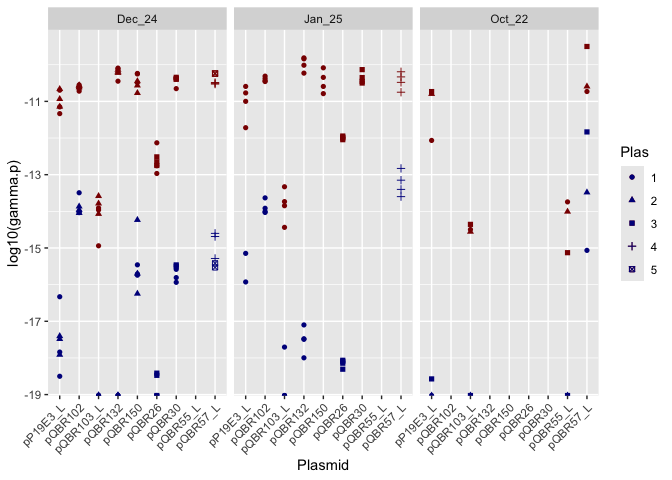<!-- -->

``` r
ggplot(data=conj_exp, aes(x=Plasmid, colour=Data)) + 
  geom_point(aes(y=log10(gamma.p)), shape=16, position=pd) + 
  geom_point(aes(y=log10(gamma.t)), shape=17, position=pd) + 
  theme(axis.text.x=element_text(angle=45, hjust=1))
```

    ## Warning: Removed 11 rows containing missing values or values outside the scale range
    ## (`geom_point()`).

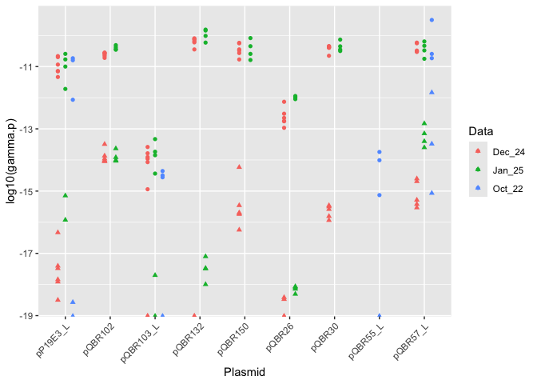<!-- -->

Filter and wrangle the dataset for analysis.

``` r
conj_exp_filtered <- conj_exp %>% 
  select(Label, Plasmid, Plas, Plas_group, Strain_Rep, 
         Plas_Rep, gamma.p, gamma.t, Dat_rep, Data) %>%
  pivot_longer(cols=c(gamma.p, gamma.t), names_to = "type", values_to = "gamma") %>%
  filter(!(Data == "Oct_22" & Plasmid != "pQBR55_L")) %>%
  mutate(Plasmid = case_when(
    Plasmid == "pQBR57_L" ~ "pQBR57",
    Plasmid == "pQBR55_L" ~ "pQBR55",  
    Plasmid == "pQBR103_L" ~ "pQBR103",
    Plasmid == "pP19E3_L" ~ "pP19E3",
    TRUE ~ Plasmid 
  )) 

Limits <- pivot_longer(lims, cols=c(gamma.p, gamma.t), names_to = "type", values_to = "gamma") %>%
  filter(type=="gamma.t")

conj_exp_filtered <- conj_exp_filtered %>%
  group_by(Plasmid, Plas_Rep) %>%
  filter(!any(is.na(gamma))) %>%
  ungroup() %>%
  group_by(Plasmid) %>%
  mutate(plas_label = dense_rank(Plas)) %>%
  ungroup()

pd <- position_dodge(width=0.5)

conj_exp_log <- conj_exp_filtered %>%
  mutate(log_gamma = log10(gamma),
         log_gamma = replace(log_gamma, log_gamma == -Inf, -20))

conj_summ <- conj_exp_log %>%
  group_by(Plasmid,Plas_group,type) %>%
  summarise(mean = mean(gamma, na.rm=TRUE),
            mean_log = mean(log_gamma),
            sd = sd(log_gamma)) %>%
  rename(log_gamma = mean_log)
```

    ## `summarise()` has grouped output by 'Plasmid', 'Plas_group'. You can override
    ## using the `.groups` argument.

Calculate summary statistics and plot.

``` r
plasgroup_colours <- data.frame(
  Plas_group = c("1","2","3","5","6"),
  colour = c("#f68600ff", #GroupII
             "#5900abff", #GroupIII
             "#00ab2fff", #GroupI
             "#AA8800", #pP19E3
             "#00a9abff") #GroupIV
  # Add all Plas_group levels and their desired colors
)

label_lookup <- unique(conj_exp_log[, c("Plasmid", "Plas_group")]) %>%
  left_join(plasgroup_colours, by="Plas_group") %>%
  mutate(Plasmid_col = paste0("<span style='color:", 
                              colour, 
                              "'>", 
                              Plasmid, 
                              "</span>")) %>%
  select(-colour)

# conj_exp_log$Plasmid_col <- NULL
conj_exp_log <- merge(conj_exp_log, label_lookup, by = c("Plasmid", "Plas_group")) %>%
  mutate(Plasmid_col = fct_reorder(Plasmid_col, as.numeric(Plas_group)))
# conj_summstat$Plasmid_col <- NULL
conj_summ <- merge(conj_summ, label_lookup, by = "Plasmid") %>%
  mutate(Plasmid_col = factor(Plasmid_col,
                              levels = levels(conj_exp_log$Plasmid_col)))
```

Plot.

``` r
pd2 <- position_jitter(height=0, width=0.15)

ggplot(conj_exp_log, aes(x=Plasmid_col, y=log_gamma,
                   ymax=log_gamma,
                   colour=type, fill=type,
                   shape=as.factor(plas_label))) +
  geom_point(position=pd2, size=4) +
  theme_bw() +
  theme(
    axis.text=element_text(size=20),
    axis.title=element_text(size=25),
    legend.text=element_text(size=25),
    legend.title=element_blank(),
    axis.text.x=element_markdown(angle=45, hjust=1),  
    legend.position = "bottom",
    panel.grid = element_blank()) +
  labs(x="Plasmid", y=expression(log[10](gamma))) +
  scale_colour_manual(values = c(col4, col7),
                      labels=c("Plasmid transfer", "Transposon transfer")) +
  scale_fill_manual(values = c(col4, col7),
                    labels=c("Plasmid transfer", "Transposon transfer")) +
  scale_shape_manual(values = c(0,16,2,3,18,4,7,8,9,11)) +
  guides(shape = "none") +
  geom_pointrange(data=conj_summ,
                  aes(x=Plasmid_col, ymin=log_gamma-sd, ymax=log_gamma+sd, shape=NULL),
                  size=2, alpha=0.3) + 
  scale_y_continuous(limits = c(min(conj_exp_log$log_gamma-1,
                                    na.rm = TRUE), NA), expand = c(0, 0)) +
  geom_hline(yintercept=log10(Limits$gamma), linetype='dotted', col='black')
```

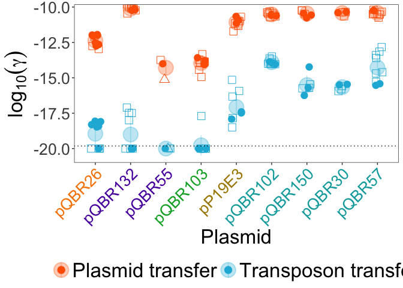<!-- -->

``` r
ggsave("Hybrid_paper.png",dpi=1200,width=15,height=10)
```

Analysing conjugation/transposon transfer rates - updated with refined
dataset for preprint

``` r
lod <-Limits$gamma

conj_m <- conj_exp_log %>% select(Label,Plasmid,Plas,plas_label,Plas_group,Plasmid_col,
                                  Strain_Rep,Plas_Rep,Dat_rep,Data,type,gamma) %>%
  pivot_wider(names_from = "type", values_from = "gamma") %>%
  mutate(gamma.t_adj = ifelse(gamma.t < lod, lod, gamma.t),
         ratio = (gamma.t_adj/gamma.p),
         log_ratio = log10(ratio))

conj_m$ratio_group <- ifelse(conj_m$gamma.t < 6e-21, 
                             "Positive", 
                             "Negative")

conj_m_summ <- conj_m %>%
  group_by(Plasmid, Plas_group) %>%
  summarise(mean = mean(log_ratio),
            std = sd(log_ratio)) %>%
  rename(log_ratio = mean) %>%
  left_join(label_lookup %>% select(Plasmid, Plasmid_col) %>%
              distinct(), by = c("Plasmid")) %>%
  mutate(ymin = log_ratio - std, ymax = log_ratio + std)
```

    ## `summarise()` has grouped output by 'Plasmid'. You can override using the
    ## `.groups` argument.

``` r
ggplot(conj_m, aes(x=Plasmid_col, y=log_ratio,
                   ymax=log_ratio, shape=as.factor(plas_label),color=ratio_group)) +
  geom_point(position=pd2, size=4) +
  theme_bw() +
  theme(
    axis.text=element_text(size=20),
    axis.title=element_text(size=25),
    legend.text=element_text(size=25),
    legend.title=element_blank(),
    axis.text.x=element_markdown(angle=45, hjust=1),  # Enable markdown for colored labels
    panel.grid = element_blank()
  ) +
  labs(x="Plasmid", y=expression(log[10](Ratio))) +
  scale_shape_manual(values = c(0,16,2,3,18,4,7,8,9,11)) +
  scale_color_manual(values = c("Positive"="purple",
                                "Negative"="black"))+
  guides(shape = "none", colour = "none") +
  geom_pointrange(data=conj_m_summ,
                  aes(x=Plasmid_col, y = log_ratio, ymin=ymin, ymax=ymax, shape=NULL),inherit.aes=FALSE,
                  size=2, alpha=0.3)
```

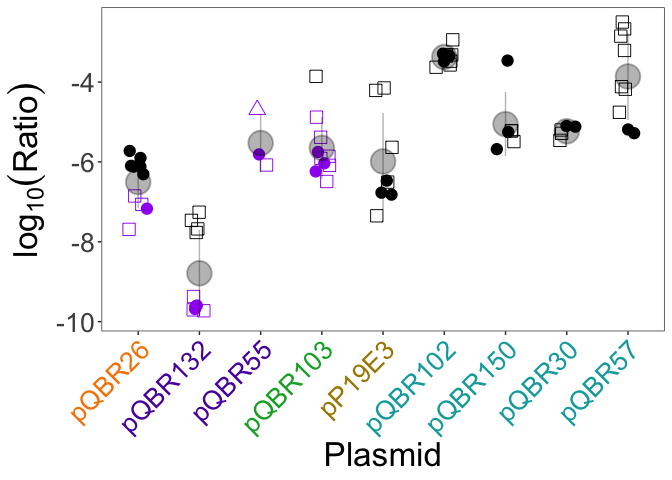<!-- -->

``` r
ggsave("Conj_Ratios_paper.png",dpi=1200,width=15,height=10)
```

Statistical tests. First run through all the data together.

``` r
# ratio depends on the plasmid
conj_mod1 <- lm(log_ratio ~ Plasmid, data = conj_m)
plot(conj_mod1)
```

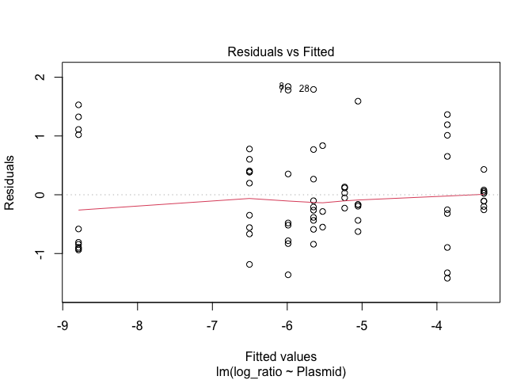<!-- -->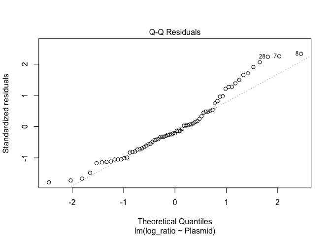<!-- -->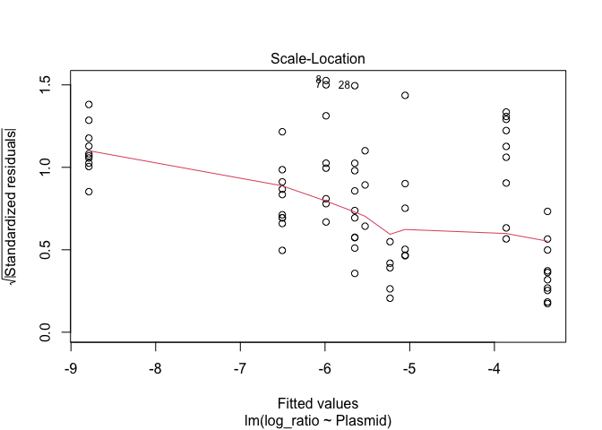<!-- -->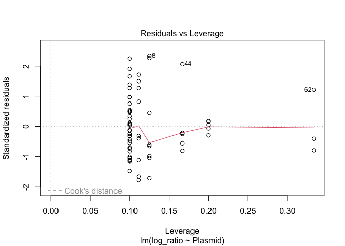<!-- -->

``` r
summary(conj_mod1)
```

    ## 
    ## Call:
    ## lm(formula = log_ratio ~ Plasmid, data = conj_m)
    ## 
    ## Residuals:
    ##     Min      1Q  Median      3Q     Max 
    ## -1.4204 -0.5544 -0.1658  0.3964  1.8405 
    ## 
    ## Coefficients:
    ##                Estimate Std. Error t value Pr(>|t|)    
    ## (Intercept)     -5.9882     0.2987 -20.048  < 2e-16 ***
    ## PlasmidpQBR102   2.6155     0.4007   6.527 1.41e-08 ***
    ## PlasmidpQBR103   0.3394     0.4007   0.847   0.4002    
    ## PlasmidpQBR132  -2.8005     0.4007  -6.988 2.25e-09 ***
    ## PlasmidpQBR150   0.9339     0.4563   2.047   0.0449 *  
    ## PlasmidpQBR26   -0.5165     0.4007  -1.289   0.2022    
    ## PlasmidpQBR30    0.7554     0.4816   1.568   0.1219    
    ## PlasmidpQBR55    0.4610     0.5720   0.806   0.4233    
    ## PlasmidpQBR57    2.1276     0.4105   5.183 2.53e-06 ***
    ## ---
    ## Signif. codes:  0 '***' 0.001 '**' 0.01 '*' 0.05 '.' 0.1 ' ' 1
    ## 
    ## Residual standard error: 0.8448 on 62 degrees of freedom
    ## Multiple R-squared:  0.8114, Adjusted R-squared:  0.7871 
    ## F-statistic: 33.34 on 8 and 62 DF,  p-value: < 2.2e-16

``` r
anova(conj_mod1) #F(8,62) = 3.34, p < 1e-15
```

    ## Analysis of Variance Table
    ## 
    ## Response: log_ratio
    ##           Df  Sum Sq Mean Sq F value    Pr(>F)    
    ## Plasmid    8 190.385 23.7981  33.341 < 2.2e-16 ***
    ## Residuals 62  44.254  0.7138                      
    ## ---
    ## Signif. codes:  0 '***' 0.001 '**' 0.01 '*' 0.05 '.' 0.1 ' ' 1

``` r
TukeyHSD(aov(conj_mod1))
```

    ##   Tukey multiple comparisons of means
    ##     95% family-wise confidence level
    ## 
    ## Fit: aov(formula = conj_mod1)
    ## 
    ## $Plasmid
    ##                       diff        lwr         upr     p adj
    ## pQBR102-pP19E3   2.6154964  1.3275629  3.90343004 0.0000005
    ## pQBR103-pP19E3   0.3394403 -0.9484933  1.62737387 0.9947977
    ## pQBR132-pP19E3  -2.8005284 -4.0884620 -1.51259480 0.0000001
    ## pQBR150-pP19E3   0.9338889 -0.5324880  2.40026577 0.5179796
    ## pQBR26-pP19E3   -0.5165190 -1.8044526  0.77141460 0.9308888
    ## pQBR30-pP19E3    0.7554167 -0.7924868  2.30332023 0.8177642
    ## pQBR55-pP19E3    0.4610393 -1.3771614  2.29924002 0.9962910
    ## pQBR57-pP19E3    2.1275515  0.8082002  3.44690269 0.0000848
    ## pQBR103-pQBR102 -2.2760562 -3.4903316 -1.06178073 0.0000035
    ## pQBR132-pQBR102 -5.4160248 -6.6303003 -4.20174941 0.0000000
    ## pQBR150-pQBR102 -1.6816076 -3.0837321 -0.27948308 0.0079727
    ## pQBR26-pQBR102  -3.1320154 -4.3462909 -1.91774000 0.0000000
    ## pQBR30-pQBR102  -1.8600798 -3.3472574 -0.37290214 0.0047451
    ## pQBR55-pQBR102  -2.1544572 -3.9418222 -0.36709211 0.0075066
    ## pQBR57-pQBR102  -0.4879450 -1.7354944  0.75960443 0.9397222
    ## pQBR132-pQBR103 -3.1399687 -4.3542441 -1.92569324 0.0000000
    ## pQBR150-pQBR103  0.5944486 -0.8076759  1.99657309 0.9073181
    ## pQBR26-pQBR103  -0.8559593 -2.0702347  0.35831617 0.3784759
    ## pQBR30-pQBR103   0.4159764 -1.0712012  1.90315403 0.9922496
    ## pQBR55-pQBR103   0.1215990 -1.6657660  1.90896406 0.9999998
    ## pQBR57-pQBR103   1.7881112  0.5405618  3.03566060 0.0006685
    ## pQBR150-pQBR132  3.7344173  2.3322928  5.13654177 0.0000000
    ## pQBR26-pQBR132   2.2840094  1.0697340  3.49828484 0.0000032
    ## pQBR30-pQBR132   3.5559451  2.0687675  5.04312270 0.0000000
    ## pQBR55-pQBR132   3.2615677  1.4742026  5.04893273 0.0000065
    ## pQBR57-pQBR132   4.9280799  3.6805304  6.17562927 0.0000000
    ## pQBR26-pQBR150  -1.4504079 -2.8525324 -0.04828336 0.0372372
    ## pQBR30-pQBR150  -0.1784722 -1.8226089  1.46566453 0.9999927
    ## pQBR55-pQBR150  -0.4728496 -2.3927876  1.44708846 0.9967290
    ## pQBR57-pQBR150   1.1936626 -0.2373747  2.62469992 0.1762037
    ## pQBR30-pQBR26    1.2719357 -0.2152419  2.75911329 0.1525102
    ## pQBR55-pQBR26    0.9775583 -0.8098068  2.76492332 0.7087708
    ## pQBR57-pQBR26    2.6440705  1.3965210  3.89161987 0.0000002
    ## pQBR55-pQBR30   -0.2943774 -2.2772809  1.68852608 0.9999190
    ## pQBR57-pQBR30    1.3721348 -0.1423328  2.88660232 0.1056840
    ## pQBR57-pQBR55    1.6665122 -0.1436228  3.47664712 0.0945937

``` r
# ratio depends on the plasmid group
conj_mod2 <- lm(log_ratio ~ Plas_group, data = conj_m)
plot(conj_mod2)
```

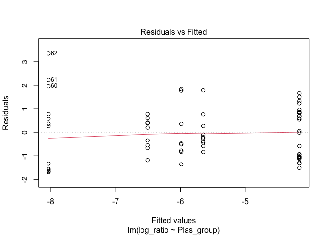<!-- -->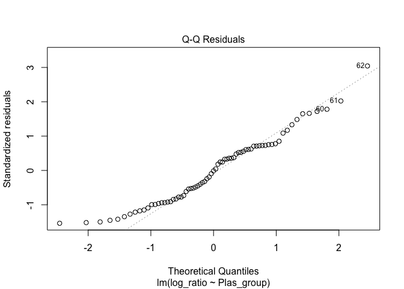<!-- -->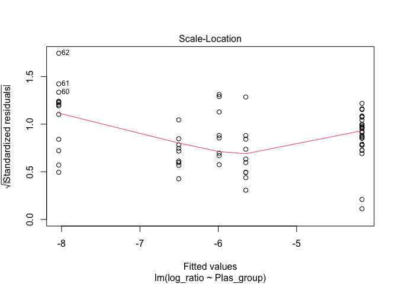<!-- -->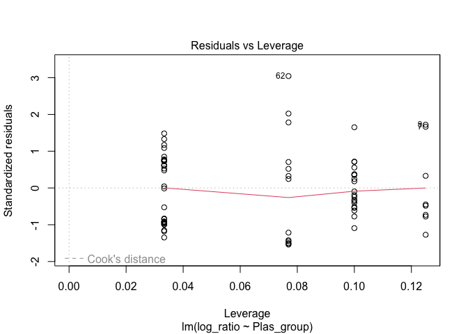<!-- -->

``` r
summary(conj_mod2)
```

    ## 
    ## Call:
    ## lm(formula = log_ratio ~ Plas_group, data = conj_m)
    ## 
    ## Residuals:
    ##     Min      1Q  Median      3Q     Max 
    ## -1.6916 -0.9871 -0.0141  0.7729  3.3444 
    ## 
    ## Coefficients:
    ##             Estimate Std. Error t value Pr(>|t|)    
    ## (Intercept)  -6.5047     0.3617 -17.982  < 2e-16 ***
    ## Plas_group2  -1.5313     0.4811  -3.183  0.00223 ** 
    ## Plas_group3   0.8560     0.5116   1.673  0.09902 .  
    ## Plas_group5   0.5165     0.5426   0.952  0.34460    
    ## Plas_group6   2.3393     0.4177   5.601 4.48e-07 ***
    ## ---
    ## Signif. codes:  0 '***' 0.001 '**' 0.01 '*' 0.05 '.' 0.1 ' ' 1
    ## 
    ## Residual standard error: 1.144 on 66 degrees of freedom
    ## Multiple R-squared:  0.6319, Adjusted R-squared:  0.6096 
    ## F-statistic: 28.33 on 4 and 66 DF,  p-value: 1.034e-13

``` r
anova(conj_mod2) #F(4,66) = 28.3, p < 1e-12
```

    ## Analysis of Variance Table
    ## 
    ## Response: log_ratio
    ##            Df Sum Sq Mean Sq F value    Pr(>F)    
    ## Plas_group  4 148.28  37.070   28.33 1.034e-13 ***
    ## Residuals  66  86.36   1.308                      
    ## ---
    ## Signif. codes:  0 '***' 0.001 '**' 0.01 '*' 0.05 '.' 0.1 ' ' 1

``` r
TukeyHSD(aov(conj_mod2))
```

    ##   Tukey multiple comparisons of means
    ##     95% family-wise confidence level
    ## 
    ## Fit: aov(formula = conj_mod2)
    ## 
    ## $Plas_group
    ##           diff        lwr        upr     p adj
    ## 2-1 -1.5313399 -2.8807681 -0.1819118 0.0182933
    ## 3-1  0.8559593 -0.5787785  2.2906970 0.4573123
    ## 5-1  0.5165190 -1.0052502  2.0382882 0.8752814
    ## 6-1  2.3392971  1.1678387  3.5107556 0.0000044
    ## 3-2  2.3872992  1.0378710  3.7367274 0.0000499
    ## 5-2  2.0478589  0.6062399  3.4894780 0.0015649
    ## 6-2  3.8706371  2.8053677  4.9359065 0.0000000
    ## 5-3 -0.3394403 -1.8612095  1.1823289 0.9704393
    ## 6-3  1.4833379  0.3118794  2.6547963 0.0062050
    ## 6-5  1.8227781  0.5462109  3.0993454 0.0014617

``` r
# directly compare conjugation rate and transposon transfer rates

ggplot(conj_m, aes(x=log10(gamma.p), y=log10(gamma.t_adj))) + 
  geom_point(aes(colour=Plasmid)) + geom_smooth(method="lm")
```

    ## `geom_smooth()` using formula = 'y ~ x'

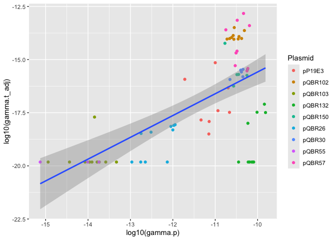<!-- -->

``` r
cor.test(x=conj_m$gamma.p, y=conj_m$gamma.t_adj, method="spearman")
```

    ## Warning in cor.test.default(x = conj_m$gamma.p, y = conj_m$gamma.t_adj, :
    ## Cannot compute exact p-value with ties

    ## 
    ##  Spearman's rank correlation rho
    ## 
    ## data:  conj_m$gamma.p and conj_m$gamma.t_adj
    ## S = 31981, p-value = 4.636e-05
    ## alternative hypothesis: true rho is not equal to 0
    ## sample estimates:
    ##       rho 
    ## 0.4637618

``` r
# significant correlation, 0.463, p < 1e-4
# but these data include pQBR103 and pQBR55 that had rare/no transposon mobilisation and low conjugation rates
# remove and retest

conj_m_flt <- conj_m %>% filter(!(Plasmid %in% c("pQBR103","pQBR55")))

cor.test(x=conj_m_flt$gamma.p, 
         y=conj_m_flt$gamma.t_adj, method="spearman")
```

    ## Warning in cor.test.default(x = conj_m_flt$gamma.p, y = conj_m_flt$gamma.t_adj,
    ## : Cannot compute exact p-value with ties

    ## 
    ##  Spearman's rank correlation rho
    ## 
    ## data:  conj_m_flt$gamma.p and conj_m_flt$gamma.t_adj
    ## S = 26471, p-value = 0.1627
    ## alternative hypothesis: true rho is not equal to 0
    ## sample estimates:
    ##       rho 
    ## 0.1857437

``` r
# rho = 0.19, p = 0.167
# nb can compare non-transformed values, since spearman's rho considers rank order

# conjugation rate depends on plasmid
conj_mod3<- lm(log10(gamma.p) ~ Plasmid, data=conj_m)
plot(conj_mod3)
```

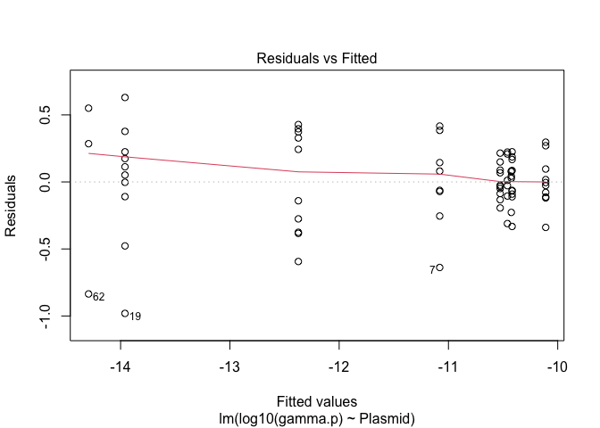<!-- -->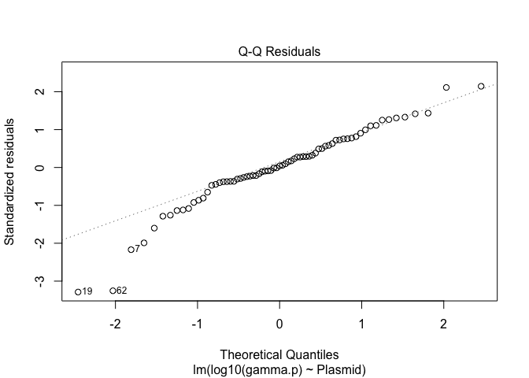<!-- -->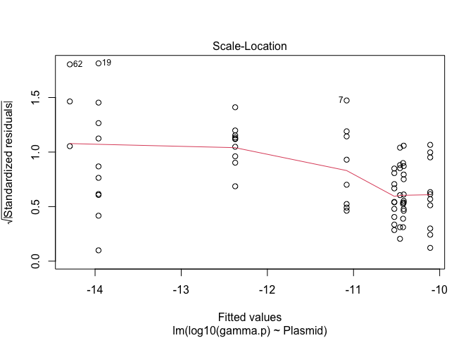<!-- -->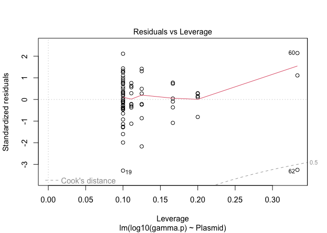<!-- -->

``` r
summary(conj_mod3)
```

    ## 
    ## Call:
    ## lm(formula = log10(gamma.p) ~ Plasmid, data = conj_m)
    ## 
    ## Residuals:
    ##      Min       1Q   Median       3Q      Max 
    ## -0.98076 -0.11154  0.01202  0.19772  0.63004 
    ## 
    ## Coefficients:
    ##                Estimate Std. Error t value Pr(>|t|)    
    ## (Intercept)    -11.0799     0.1111 -99.686  < 2e-16 ***
    ## PlasmidpQBR102   0.5532     0.1491   3.710 0.000446 ***
    ## PlasmidpQBR103  -2.8799     0.1491 -19.313  < 2e-16 ***
    ## PlasmidpQBR132   0.9699     0.1491   6.504 1.54e-08 ***
    ## PlasmidpQBR150   0.6194     0.1698   3.648 0.000543 ***
    ## PlasmidpQBR26   -1.2936     0.1491  -8.675 2.69e-12 ***
    ## PlasmidpQBR30    0.6551     0.1792   3.655 0.000531 ***
    ## PlasmidpQBR55   -3.2131     0.2128 -15.097  < 2e-16 ***
    ## PlasmidpQBR57    0.6623     0.1528   4.336 5.44e-05 ***
    ## ---
    ## Signif. codes:  0 '***' 0.001 '**' 0.01 '*' 0.05 '.' 0.1 ' ' 1
    ## 
    ## Residual standard error: 0.3144 on 62 degrees of freedom
    ## Multiple R-squared:  0.9592, Adjusted R-squared:  0.9539 
    ## F-statistic:   182 on 8 and 62 DF,  p-value: < 2.2e-16

``` r
anova(conj_mod3) #F(8,62)=182, p < 1e-15
```

    ## Analysis of Variance Table
    ## 
    ## Response: log10(gamma.p)
    ##           Df  Sum Sq Mean Sq F value    Pr(>F)    
    ## Plasmid    8 143.934 17.9917  182.05 < 2.2e-16 ***
    ## Residuals 62   6.127  0.0988                      
    ## ---
    ## Signif. codes:  0 '***' 0.001 '**' 0.01 '*' 0.05 '.' 0.1 ' ' 1

``` r
TukeyHSD(aov(conj_mod3))
```

    ##   Tukey multiple comparisons of means
    ##     95% family-wise confidence level
    ## 
    ## Fit: aov(formula = conj_mod3)
    ## 
    ## $Plasmid
    ##                         diff         lwr        upr     p adj
    ## pQBR102-pP19E3   0.553196697  0.07395033  1.0324431 0.0123847
    ## pQBR103-pP19E3  -2.879921956 -3.35916832 -2.4006756 0.0000000
    ## pQBR132-pP19E3   0.969930900  0.49068453  1.4491773 0.0000005
    ## pQBR150-pP19E3   0.619400072  0.07375408  1.1650461 0.0148717
    ## pQBR26-pP19E3   -1.293571566 -1.77281793 -0.8143252 0.0000000
    ## pQBR30-pP19E3    0.655058826  0.07907638  1.2310413 0.0145750
    ## pQBR55-pP19E3   -3.213122279 -3.89712573 -2.5291188 0.0000000
    ## pQBR57-pP19E3    0.662291254  0.17135423  1.1532283 0.0016867
    ## pQBR103-pQBR102 -3.433118653 -3.88495646 -2.9812808 0.0000000
    ## pQBR132-pQBR102  0.416734203 -0.03510360  0.8685720 0.0934040
    ## pQBR150-pQBR102  0.066203375 -0.45553398  0.5879407 0.9999756
    ## pQBR26-pQBR102  -1.846768263 -2.29860607 -1.3949305 0.0000000
    ## pQBR30-pQBR102   0.101862129 -0.45152391  0.6552482 0.9995942
    ## pQBR55-pQBR102  -3.766318976 -4.43140622 -3.1012317 0.0000000
    ## pQBR57-pQBR102   0.109094557 -0.35512466  0.5733138 0.9976399
    ## pQBR132-pQBR103  3.849852856  3.39801505  4.3016907 0.0000000
    ## pQBR150-pQBR103  3.499322028  2.97758467  4.0210594 0.0000000
    ## pQBR26-pQBR103   1.586350390  1.13451258  2.0381882 0.0000000
    ## pQBR30-pQBR103   3.534980782  2.98159474  4.0883668 0.0000000
    ## pQBR55-pQBR103  -0.333200323 -0.99828757  0.3318869 0.7956734
    ## pQBR57-pQBR103   3.542213210  3.07799399  4.0064324 0.0000000
    ## pQBR150-pQBR132 -0.350530828 -0.87226819  0.1712065 0.4443769
    ## pQBR26-pQBR132  -2.263502466 -2.71534027 -1.8116647 0.0000000
    ## pQBR30-pQBR132  -0.314872074 -0.86825811  0.2385140 0.6634001
    ## pQBR55-pQBR132  -4.183053179 -4.84814042 -3.5179659 0.0000000
    ## pQBR57-pQBR132  -0.307639646 -0.77185886  0.1565796 0.4633219
    ## pQBR26-pQBR150  -1.912971638 -2.43470900 -1.3912343 0.0000000
    ## pQBR30-pQBR150   0.035658754 -0.57613253  0.6474500 0.9999999
    ## pQBR55-pQBR150  -3.832522351 -4.54694065 -3.1181040 0.0000000
    ## pQBR57-pQBR150   0.042891182 -0.48960478  0.5753871 0.9999993
    ## pQBR30-pQBR26    1.948630392  1.39524435  2.5020164 0.0000000
    ## pQBR55-pQBR26   -1.919550713 -2.58463796 -1.2544635 0.0000000
    ## pQBR57-pQBR26    1.955862820  1.49164360  2.4200820 0.0000000
    ## pQBR55-pQBR30   -3.868181105 -4.60602915 -3.1303331 0.0000000
    ## pQBR57-pQBR30    0.007232428 -0.55630833  0.5707732 1.0000000
    ## pQBR57-pQBR55    3.875413533  3.20185350  4.5489736 0.0000000

These analyses look at the aggregated data. Are the results consistent
if each experiment is analysed separately?

Main results:

- correlation between gamma.p and gamma.t, which is lost if the
  low-conjugation rate plasmids are removed
- significant difference between plasmids

``` r
ggplot(data=conj_m, aes(x=Plasmid, colour=Data)) + 
  geom_point(aes(y=log10(gamma.p)), shape=16, position=pd) + 
  geom_point(aes(y=log10(gamma.t)), shape=17, position=pd) + 
  theme(axis.text.x=element_text(angle=45, hjust=1))
```

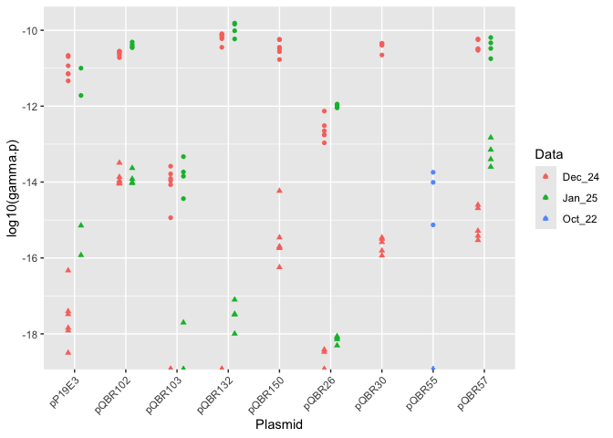<!-- -->

``` r
conj_m_24 <- filter(conj_m_flt, Data=="Dec_24")
conj_m_25 <- filter(conj_m_flt, Data=="Jan_25")

cor.test(x=conj_m_24$gamma.p, 
         y=conj_m_24$gamma.t_adj, method="spearman")
```

    ## Warning in cor.test.default(x = conj_m_24$gamma.p, y = conj_m_24$gamma.t_adj, :
    ## Cannot compute exact p-value with ties

    ## 
    ##  Spearman's rank correlation rho
    ## 
    ## data:  conj_m_24$gamma.p and conj_m_24$gamma.t_adj
    ## S = 9758, p-value = 0.6037
    ## alternative hypothesis: true rho is not equal to 0
    ## sample estimates:
    ##        rho 
    ## 0.08461614

``` r
cor.test(x=conj_m_25$gamma.p, 
         y=conj_m_25$gamma.t_adj, method="spearman")
```

    ## 
    ##  Spearman's rank correlation rho
    ## 
    ## data:  conj_m_25$gamma.p and conj_m_25$gamma.t_adj
    ## S = 618, p-value = 0.1401
    ## alternative hypothesis: true rho is not equal to 0
    ## sample estimates:
    ##       rho 
    ## 0.3622291

``` r
# both of these results are nonsignificant, because pQBR55 is omitted from these experiments, as above. 

conj_mod1_24 <- lm(log_ratio ~ Plasmid, data = filter(conj_m, Data=="Dec_24"))
anova(conj_mod1_24) # significant effect of plasmid
```

    ## Analysis of Variance Table
    ## 
    ## Response: log_ratio
    ##           Df  Sum Sq Mean Sq F value    Pr(>F)    
    ## Plasmid    7 144.741 20.6773   75.71 < 2.2e-16 ***
    ## Residuals 38  10.378  0.2731                      
    ## ---
    ## Signif. codes:  0 '***' 0.001 '**' 0.01 '*' 0.05 '.' 0.1 ' ' 1

``` r
conj_mod1_24_results <- as.data.frame(TukeyHSD(aov(conj_mod1_24))$Plasmid) %>%
  rownames_to_column("comparison") %>% mutate(star = ifelse(`p adj` < 0.05, "*", ""))

conj_mod1_25 <- lm(log_ratio ~ Plasmid, data = filter(conj_m, Data=="Jan_25"))
anova(conj_mod1_25) # significant effect of plasmid
```

    ## Analysis of Variance Table
    ## 
    ## Response: log_ratio
    ##           Df Sum Sq Mean Sq F value    Pr(>F)    
    ## Plasmid    5 61.669 12.3338  43.413 9.491e-09 ***
    ## Residuals 16  4.546  0.2841                      
    ## ---
    ## Signif. codes:  0 '***' 0.001 '**' 0.01 '*' 0.05 '.' 0.1 ' ' 1

``` r
conj_mod1_25_results <- as.data.frame(TukeyHSD(aov(conj_mod1_25))$Plasmid) %>%
  rownames_to_column("comparison") %>% mutate(star = ifelse(`p adj` < 0.05, "*", ""))

left_join(conj_mod1_24_results, conj_mod1_25_results, by="comparison",
          suffix = c(".24",".25")) %>%
  select(comparison, `p adj.24`, `p adj.25`, star.24, star.25) %>% kable()
```

| comparison      |  p adj.24 |  p adj.25 | star.24 | star.25 |
|:----------------|----------:|----------:|:--------|:--------|
| pQBR102-pP19E3  | 0.0000000 | 0.6868088 | \*      |         |
| pQBR103-pP19E3  | 0.1557342 | 0.1159639 |         |         |
| pQBR132-pP19E3  | 0.0000000 | 0.0000229 | \*      | \*      |
| pQBR150-pP19E3  | 0.0002452 |        NA | \*      | NA      |
| pQBR26-pP19E3   | 0.9997216 | 0.0061059 |         | \*      |
| pQBR30-pP19E3   | 0.0026923 |        NA | \*      | NA      |
| pQBR57-pP19E3   | 0.0000166 | 0.0795785 | \*      |         |
| pQBR103-pQBR102 | 0.0000000 | 0.0010588 | \*      | \*      |
| pQBR132-pQBR102 | 0.0000000 | 0.0000001 | \*      | \*      |
| pQBR150-pQBR102 | 0.0000233 |        NA | \*      | NA      |
| pQBR26-pQBR102  | 0.0000000 | 0.0000338 | \*      | \*      |
| pQBR30-pQBR102  | 0.0000094 |        NA | \*      | NA      |
| pQBR57-pQBR102  | 0.0015788 | 0.4692090 | \*      |         |
| pQBR132-pQBR103 | 0.0000000 | 0.0005335 | \*      | \*      |
| pQBR150-pQBR103 | 0.2702280 |        NA |         | NA      |
| pQBR26-pQBR103  | 0.0548891 | 0.4501664 |         |         |
| pQBR30-pQBR103  | 0.6716405 |        NA |         | NA      |
| pQBR57-pQBR103  | 0.0313408 | 0.0000359 | \*      | \*      |
| pQBR150-pQBR132 | 0.0000000 |        NA | \*      | NA      |
| pQBR26-pQBR132  | 0.0000000 | 0.0212143 | \*      | \*      |
| pQBR30-pQBR132  | 0.0000000 |        NA | \*      | NA      |
| pQBR57-pQBR132  | 0.0000000 | 0.0000000 | \*      | \*      |
| pQBR26-pQBR150  | 0.0000570 |        NA | \*      | NA      |
| pQBR30-pQBR150  | 0.9991120 |        NA |         | NA      |
| pQBR57-pQBR150  | 0.9515242 |        NA |         | NA      |
| pQBR30-pQBR26   | 0.0007107 |        NA | \*      | NA      |
| pQBR57-pQBR26   | 0.0000041 | 0.0000017 | \*      | \*      |
| pQBR57-pQBR30   | 0.7479302 |        NA |         | NA      |

Where there is a significant effect for one experiment, there’s usually
a significant effect for the other (and vice versa). A few exceptions,
mostly because pP19E3 had only 2 replicates in the Jan_25 dataset and
hence large standard error. Some minor discrepancies between the pQBR102
and pQBR57 data also (better than expected mobilisation for pQBR57 in
the January dataset).

The main results thus stand when the experiments are analysed
separately, justifying aggregation in the figure.

``` r
#Getting some exact numbers for how many tns per plasmid transfer
p57 <- conj_m %>%
  filter(Plasmid == "pQBR57") %>%
  summarise(
    plasmid_mean_log10 = mean(log10(gamma.p), na.rm = TRUE),
    plasmid_sd_log10   = sd(log10(gamma.p), na.rm = TRUE),
    transposon_mean_log10 = mean(log10(gamma.t), na.rm = TRUE),
    transposon_sd_log10   = sd(log10(gamma.t), na.rm = TRUE)
  )

p102 <- conj_m %>%
  filter(Plasmid == "pQBR102") %>%
  summarise(
    plasmid_mean_log10 = mean(log10(gamma.p), na.rm = TRUE),
    plasmid_sd_log10   = sd(log10(gamma.p), na.rm = TRUE),
    transposon_mean_log10 = mean(log10(gamma.t), na.rm = TRUE),
    transposon_sd_log10   = sd(log10(gamma.t), na.rm = TRUE)
  )

log10_ratio_57 <- p57$plasmid_mean_log10 - p57$transposon_mean_log10
sd_log10_ratio_57 <- sqrt(p57$plasmid_sd_log10^2 +
                            p57$transposon_sd_log10^2)

(ratio_57 <- 10^log10_ratio_57) #7255
```

    ## [1] 7255.084

``` r
log10_ratio_102 <- p102$plasmid_mean_log10 - p102$transposon_mean_log10
sd_log10_ratio_102 <- sqrt(p102$plasmid_sd_log10^2 +
                             p102$transposon_sd_log10^2)

(ratio_102 <- 10^log10_ratio_102) #2359
```

    ## [1] 2358.834

``` r
(ci_57 <- 10^(log10_ratio_57 + c(-1, 1) * 1.96 * sd_log10_ratio_57)) #60 to 8.74e5
```

    ## [1]     60.1603 874933.1631

``` r
(ci_102 <- 10^(log10_ratio_102 + c(-1, 1) * 1.96 * sd_log10_ratio_102)) #842 to 6604
```

    ## [1]  842.4637 6604.5568

Now analysing the comparative fitness data

``` r
#calculating fitness - w
comp1 <- exp_df %>%
  mutate(Mlac = (log(End_R/(Start_R/100))/24),
         Mvs  = (log(End_D/(Start_D/100))/24),
         w = Mvs/Mlac)

con <- filter(comp1, Plasmid == "Con")

(con_mean <- con %>%
  select(w) %>% summarise(w = mean(w)) %>% pull()) # 1.009498
```

    ## [1] 1.009498

``` r
t.test(con$w, mu=1, data=con) # t = 0.82179, df = 9, p = 0.4324
```

    ## 
    ##  One Sample t-test
    ## 
    ## data:  con$w
    ## t = 0.82179, df = 9, p-value = 0.4324
    ## alternative hypothesis: true mean is not equal to 1
    ## 95 percent confidence interval:
    ##  0.9833528 1.0356433
    ## sample estimates:
    ## mean of x 
    ##  1.009498

``` r
comp3 <- comp1 %>% mutate(w_corr = w/con_mean) %>% #filter(Plasmid != "pQBR57_L") %>% 
  mutate(Plasmid = case_when(
    Plasmid == "pQBR55_L" ~ "pQBR55",  
    Plasmid == "pQBR103_L" ~ "pQBR103",
    Plasmid == "pP19E3_L" ~ "pP19E3",
    Plasmid == "pQBR57_L" ~ "pQBR57",
    TRUE ~ Plasmid)) %>%
  filter(Plasmid != "Con")

comp3$Plas_group <- as.numeric(comp3$Plas_group)
comp3$Plasmid <- as.factor(comp3$Plasmid)

comp3stat <- comp3 %>%
  group_by(Plasmid) %>%
  summarise(mean=mean(w_corr),
            std=sd(w_corr))%>%
  mutate(ymin = mean - std,
         ymax = mean + std) %>%
  rename("w_corr"="mean")

plasgroup_colors2 <- c(
  "1" = "#f68600ff", #GroupII
  "2" = "#5900abff", #GroupIII
  "3" = "#00ab2fff", #GroupI
  "4" = "#AA8800", #pP19E3
  "5" = "#00a9abff", #GroupIV
  "Con" = "black"
  # Add all Plas_group levels and their desired colors
)

label_lookup2 <- unique(comp3[, c("Plasmid", "Plas_group")])
label_lookup2$Plasmid_col <- paste0(
  "<span style='color:", 
  plasgroup_colors2[label_lookup2$Plas_group], 
  "'>", 
  label_lookup2$Plasmid, 
  "</span>")

comp3$Plasmid_col <- NULL
comp3 <- merge(comp3, label_lookup2,
               by = c("Plasmid", "Plas_group"))
comp3stat$Plasmid_col <- NULL
comp3stat <- merge(comp3stat,
                   label_lookup2, by = "Plasmid")

comp3$Plasmid_col <- fct_reorder(comp3$Plasmid_col,
                                 comp3$Plas_group)
comp3stat$Plasmid_col <- factor(comp3stat$Plasmid_col,
                                levels = levels(comp3$Plasmid_col))


pd <- position_jitterdodge(dodge.width=0.6, jitter.width = 0.1)
pd2<-position_dodge(width=0.6)

ggplot(comp3, aes(x=Plasmid_col,y=w_corr))+ 
  geom_point(position=pd2,size=4)+
  geom_hline(yintercept = 1, linetype="dashed")+
  theme_bw()+
  theme(axis.text=element_text(size=20),axis.title=element_text(size=25), legend.text=element_text(size=25),legend.title=element_text(size=25),
        axis.text.x = ggtext::element_markdown(angle = 45, hjust = 1))+labs(x="Plasmid", y="Relative Fitness (W)")+ 
  geom_pointrange(data=comp3stat,aes(x=Plasmid_col,ymin=w_corr-std,ymax=w_corr+std),size=2,alpha=0.3,position=pd2) +
   scale_y_continuous(breaks = seq(0.5, max(comp3$w_corr) + 0.2, by = 0.2))
```

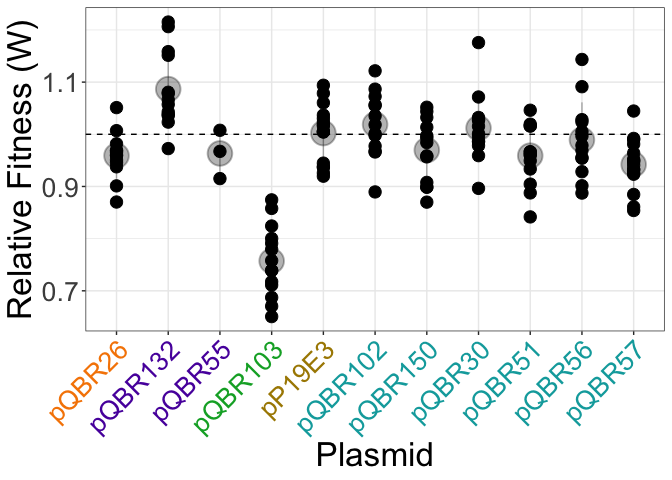<!-- -->

``` r
ggsave("Comp_fit.png",dpi=1200,width=12,height=10)
```

Analysing fitness values

``` r
fit <- comp3

F3 <- aov(w_corr ~ Plasmid, data = fit)

summary(F3)
```

    ##              Df Sum Sq Mean Sq F value Pr(>F)    
    ## Plasmid      10 0.9018 0.09018   24.43 <2e-16 ***
    ## Residuals   129 0.4761 0.00369                   
    ## ---
    ## Signif. codes:  0 '***' 0.001 '**' 0.01 '*' 0.05 '.' 0.1 ' ' 1

``` r
TukeyHSD(F3)
```

    ##   Tukey multiple comparisons of means
    ##     95% family-wise confidence level
    ## 
    ## Fit: aov(formula = w_corr ~ Plasmid, data = fit)
    ## 
    ## $Plasmid
    ##                          diff          lwr          upr     p adj
    ## pQBR102-pP19E3   1.653975e-02 -0.057804363  0.090883862 0.9996915
    ## pQBR103-pP19E3  -2.452135e-01 -0.318077966 -0.172349007 0.0000000
    ## pQBR132-pP19E3   8.426730e-02  0.009923192  0.158611417 0.0129906
    ## pQBR150-pP19E3  -3.262423e-02 -0.106968338  0.041719887 0.9362893
    ## pQBR26-pP19E3   -4.329895e-02 -0.117643064  0.031045161 0.7104950
    ## pQBR30-pP19E3    9.519055e-03 -0.064825058  0.083863167 0.9999982
    ## pQBR51-pP19E3   -4.329362e-02 -0.117637728  0.031050497 0.7106482
    ## pQBR55-pP19E3   -3.900282e-02 -0.164269458  0.086263824 0.9946390
    ## pQBR56-pP19E3   -1.292505e-02 -0.087269162  0.061419062 0.9999676
    ## pQBR57-pP19E3   -6.018091e-02 -0.130574686  0.010212864 0.1692691
    ## pQBR103-pQBR102 -2.617532e-01 -0.338440887 -0.185065584 0.0000000
    ## pQBR132-pQBR102  6.772755e-02 -0.010367327  0.145822437 0.1543112
    ## pQBR150-pQBR102 -4.916397e-02 -0.127258857  0.028930907 0.6053643
    ## pQBR26-pQBR102  -5.983870e-02 -0.137933583  0.018256180 0.3080536
    ## pQBR30-pQBR102  -7.020695e-03 -0.085115576  0.071074187 0.9999999
    ## pQBR51-pQBR102  -5.983337e-02 -0.137928247  0.018261517 0.3081813
    ## pQBR55-pQBR102  -5.554257e-02 -0.183070974  0.071985841 0.9392603
    ## pQBR56-pQBR102  -2.946480e-02 -0.107559681  0.048630082 0.9769977
    ## pQBR57-pQBR102  -7.672066e-02 -0.151064773 -0.002376549 0.0368729
    ## pQBR132-pQBR103  3.294808e-01  0.252793139  0.406168442 0.0000000
    ## pQBR150-pQBR103  2.125893e-01  0.135901609  0.289276912 0.0000000
    ## pQBR26-pQBR103   2.019145e-01  0.125226883  0.278602186 0.0000000
    ## pQBR30-pQBR103   2.547325e-01  0.178044890  0.331420192 0.0000000
    ## pQBR51-pQBR103   2.019199e-01  0.125232219  0.278607522 0.0000000
    ## pQBR55-pQBR103   2.062107e-01  0.079539125  0.332882213 0.0000220
    ## pQBR56-pQBR103   2.322884e-01  0.155600785  0.308976087 0.0000000
    ## pQBR57-pQBR103   1.850326e-01  0.112168095  0.257897054 0.0000000
    ## pQBR150-pQBR132 -1.168915e-01 -0.194986412 -0.038796648 0.0001423
    ## pQBR26-pQBR132  -1.275663e-01 -0.205661138 -0.049471375 0.0000203
    ## pQBR30-pQBR132  -7.474825e-02 -0.152843131  0.003346632 0.0737630
    ## pQBR51-pQBR132  -1.275609e-01 -0.205655802 -0.049466038 0.0000203
    ## pQBR55-pQBR132  -1.232701e-01 -0.250798529  0.004258286 0.0678274
    ## pQBR56-pQBR132  -9.719235e-02 -0.175287236 -0.019097473 0.0036797
    ## pQBR57-pQBR132  -1.444482e-01 -0.218792328 -0.070104104 0.0000002
    ## pQBR26-pQBR150  -1.067473e-02 -0.088769608  0.067420155 0.9999967
    ## pQBR30-pQBR150   4.214328e-02 -0.035951601  0.120238162 0.7960859
    ## pQBR51-pQBR150  -1.066939e-02 -0.088764272  0.067425491 0.9999967
    ## pQBR55-pQBR150  -6.378592e-03 -0.133906999  0.121149816 1.0000000
    ## pQBR56-pQBR150   1.969918e-02 -0.058395706  0.097794057 0.9990706
    ## pQBR57-pQBR150  -2.755669e-02 -0.101900798  0.046787426 0.9797513
    ## pQBR30-pQBR26    5.281801e-02 -0.025276875  0.130912888 0.4975857
    ## pQBR51-pQBR26    5.336208e-06 -0.078089545  0.078100218 1.0000000
    ## pQBR55-pQBR26    4.296135e-03 -0.123232273  0.131824543 1.0000000
    ## pQBR56-pQBR26    3.037390e-02 -0.047720980  0.108468783 0.9714844
    ## pQBR57-pQBR26   -1.688196e-02 -0.091226072  0.057462153 0.9996299
    ## pQBR51-pQBR30   -5.281267e-02 -0.130907552  0.025282211 0.4977416
    ## pQBR55-pQBR30   -4.852187e-02 -0.176050279  0.079006536 0.9755780
    ## pQBR56-pQBR30   -2.244410e-02 -0.100538986  0.055650777 0.9972017
    ## pQBR57-pQBR30   -6.969997e-02 -0.144044079  0.004644146 0.0874533
    ## pQBR55-pQBR51    4.290799e-03 -0.123237609  0.131819206 1.0000000
    ## pQBR56-pQBR51    3.036857e-02 -0.047726316  0.108463447 0.9715194
    ## pQBR57-pQBR51   -1.688730e-02 -0.091231408  0.057456817 0.9996288
    ## pQBR56-pQBR55    2.607777e-02 -0.101450641  0.153606175 0.9998556
    ## pQBR57-pQBR55   -2.117809e-02 -0.146444735  0.104088546 0.9999751
    ## pQBR57-pQBR56   -4.725586e-02 -0.121599974  0.027088251 0.5913397

------------------------------------------------------------------------

**[Back to index.](../4_Analysis.md)**
