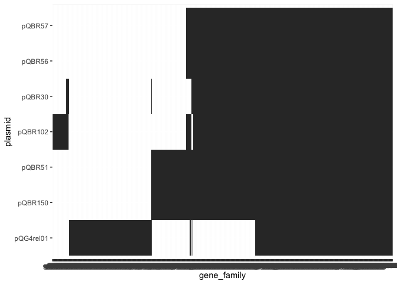
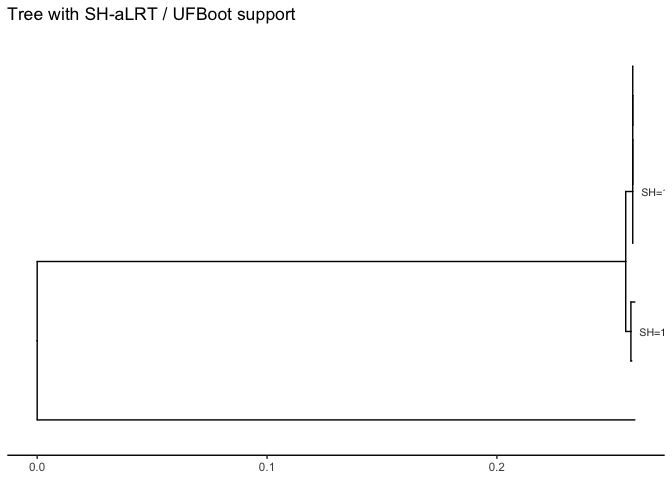
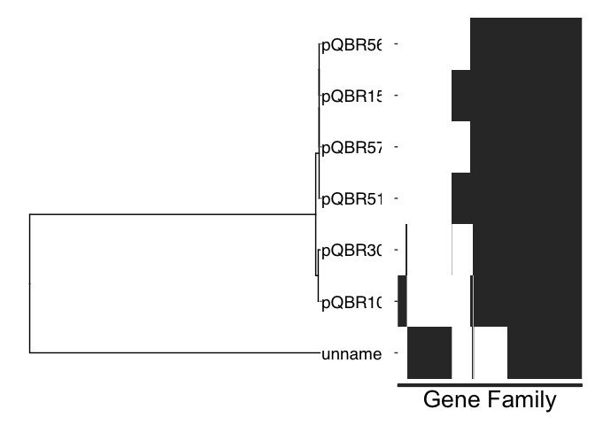

Creating tree for Group IV
================

Data analysis for manuscript “The pQBR mercury resistance plasmids: a
model set of sympatric environmental mobile genetic elements”. Code
written by Victoria T Orr (<Victoria.Orr@liverpool.ac.uk>), supervised
by [James P.J. Hall](mailto:j.p.j.hall@liverpool.ac.uk).

Code for creating trees and heatmaps for Group IV plasmids.

``` r
group_iv_rel_pirate <- read.table("PIRATE.gene_families.ordered.tsv",
                                 header=TRUE, sep="\t")

giprel_matrix <- data.frame(cbind(group_iv_rel_pirate[2], ifelse(group_iv_rel_pirate[23:length(group_iv_rel_pirate)]=="", 0, 1))) %>%
  column_to_rownames("gene_family")

giprel_genefam_dendro <- hclust(dist(giprel_matrix))  
giprel_plasmid_dendro <- hclust(dist(t(giprel_matrix)))

giprel_genefam_order <- rownames(giprel_matrix)[giprel_genefam_dendro$order]
giprel_plasmid_order <- colnames(giprel_matrix)[giprel_plasmid_dendro$order]

giprel_long <- group_iv_rel_pirate %>% select(gene_family, threshold, starts_with("pQ")) %>%
  pivot_longer(cols = starts_with("pQ"), names_to = "plasmid", values_to = "gene") %>% 
  filter(gene != "") %>%
  mutate(gene_family = factor(gene_family, levels=rev(giprel_genefam_order)),
         plasmid = factor(plasmid, levels=giprel_plasmid_order))

ggplot(giprel_long, aes(x=gene_family, y=plasmid)) + geom_tile()
```

<!-- -->

#### Create a core genome tree for Group IV and relative

Check alignment from PIRATE. Trim gappy/misaligned columns. Align using
IQtree3.

    -m MFP               Extended model selection followed by tree inference
    -B 1000              1000 bootstrap replicates
    --alrt 1000          1000 replicates for SH approximate likelihood ratio test
    -T AUTO              Automatic thread assignment

``` bash
trimal -in core_alignment.fasta \
-out core_rel_aln.trimmed.fasta \
-gt 0.9

iqtree3 -s core_rel_aln.trimmed.fasta  \
-m MFP \
-B 1000 --alrt 1000 \
-T AUTO \
-pre group_i_tree

mv group_i_tree* ./trees/
```

Note: several sequences were identical in the tree.

Plot tree. Note: a fudge is required until ggtree is updated.

``` r
if (!exists("is.waive")) {
  is.waive <- \(x) inherits(x, "waiver") # nolint
}

gi_tr <- read.tree("./trees/group_i_tree.treefile")

tr_mid <- midpoint(gi_tr)
tr_mid$tip.label <- recode(tr_mid$tip.label,
                           "pQG4rel01" = "unnamed1")

tb <- as_tibble(tr_mid)

supports <- tb %>%
  transmute(node,
            sh_alrt = as.numeric(str_extract(label, "^[^/]+")),
            ufboot  = as.numeric(str_extract(label, "(?<=/).+$")))
```

    ## Warning: There was 1 warning in `transmute()`.
    ## ℹ In argument: `sh_alrt = as.numeric(str_extract(label, "^[^/]+"))`.
    ## Caused by warning:
    ## ! NAs introduced by coercion

``` r
p_sup <- ggtree(tr_mid) +
  theme_tree2() +
  geom_text2(
    aes(subset = !isTip, label =
          ifelse(!is.na(supports$ufboot),
                paste0("SH=", round(supports$sh_alrt), " / UF=", round(supports$ufboot)),
                 round(as.numeric(label)))),
    hjust = -0.1, size = 2.8, color = "grey20") +
  ggtitle("Tree with SH-aLRT / UFBoot support")
```

    ## Warning: `aes_()` was deprecated in ggplot2 3.0.0.
    ## ℹ Please use tidy evaluation idioms with `aes()`
    ## ℹ The deprecated feature was likely used in the ggtree package.
    ##   Please report the issue at <https://github.com/YuLab-SMU/ggtree/issues>.
    ## This warning is displayed once every 8 hours.
    ## Call `lifecycle::last_lifecycle_warnings()` to see where this warning was
    ## generated.

    ## Warning in fortify(data, ...): Arguments in `...` must be used.
    ## ✖ Problematic arguments:
    ## • as.Date = as.Date
    ## • yscale_mapping = yscale_mapping
    ## • hang = hang
    ## ℹ Did you misspell an argument name?

``` r
p_sup
```

    ## Warning in ifelse(!is.na(supports$ufboot), paste0("SH=",
    ## round(supports$sh_alrt), : NAs introduced by coercion

<!-- -->

``` r
tree <- ggtree(tr_mid) + 
  geom_tiplab(size=5, align=TRUE) + xlim(0,0.3)
```

    ## Warning in fortify(data, ...): Arguments in `...` must be used.
    ## ✖ Problematic arguments:
    ## • as.Date = as.Date
    ## • yscale_mapping = yscale_mapping
    ## • hang = hang
    ## ℹ Did you misspell an argument name?

    ## Warning: `aes_string()` was deprecated in ggplot2 3.0.0.
    ## ℹ Please use tidy evaluation idioms with `aes()`.
    ## ℹ See also `vignette("ggplot2-in-packages")` for more information.
    ## ℹ The deprecated feature was likely used in the ggtree package.
    ##   Please report the issue at <https://github.com/YuLab-SMU/ggtree/issues>.
    ## This warning is displayed once every 8 hours.
    ## Call `lifecycle::last_lifecycle_warnings()` to see where this warning was
    ## generated.

``` r
tree_order <- get_taxa_name(p_sup)

giprel_long_filtered <- giprel_long
giprel_long_filtered$plasmid <- recode(giprel_long$plasmid,
                                       "pQG4rel01" = "unnamed1")
heatmap <- ggplot(giprel_long_filtered,
                  aes(x=gene_family,
                      y=factor(plasmid, levels=rev(tree_order)))) +
  geom_tile() +ylab(NULL) +xlab("Gene Family") +
  theme(axis.text.x = element_blank(),
        axis.title.x = element_text(size=20),
        axis.text.y = element_blank())

tree + heatmap + plot_layout(widths = c(2,1))
```

<!-- -->

``` r
ggsave("GroupIV_heattree.png", dpi = 500, height=10, width=15)
```

------------------------------------------------------------------------

**[Back to index.](../../4_Analysis.md)**
