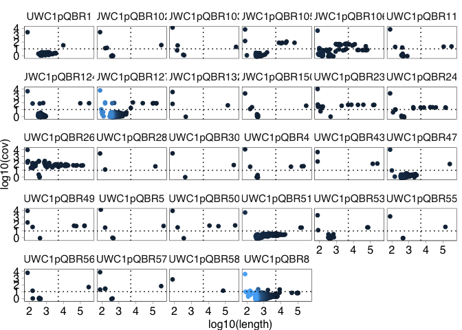
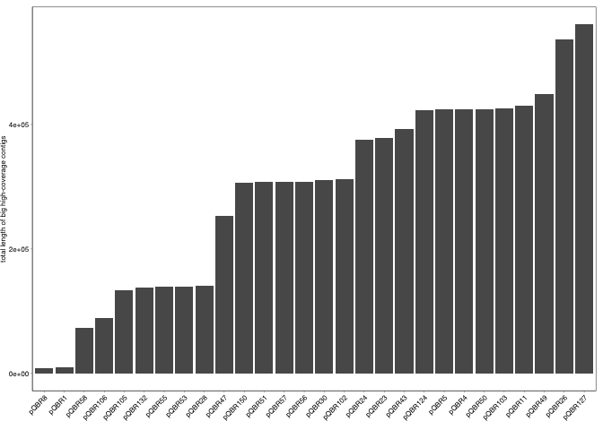
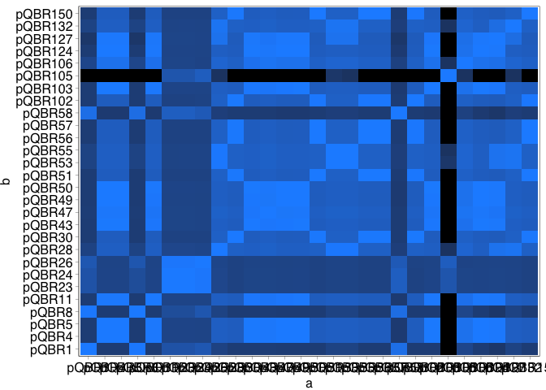
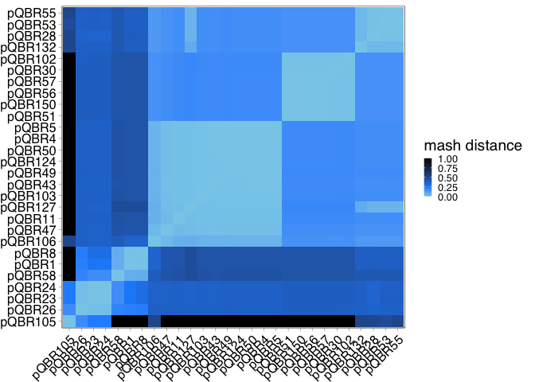
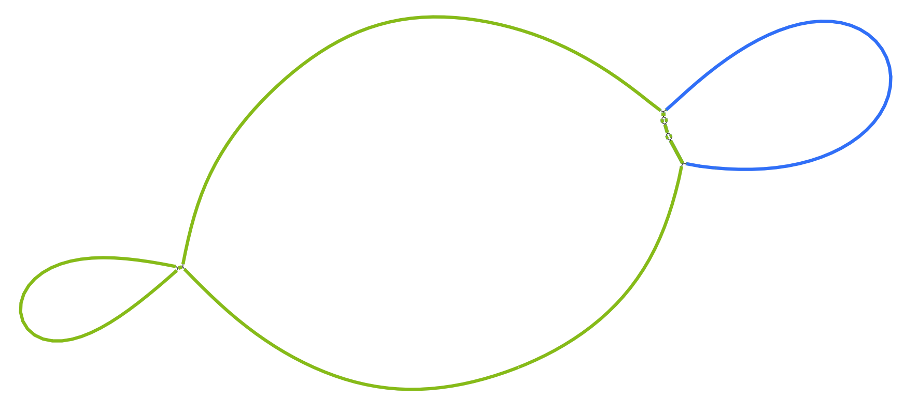
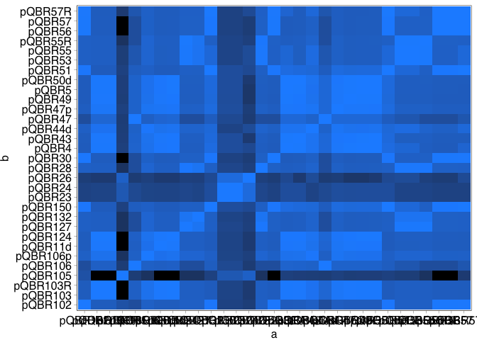
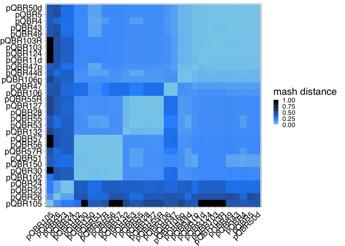
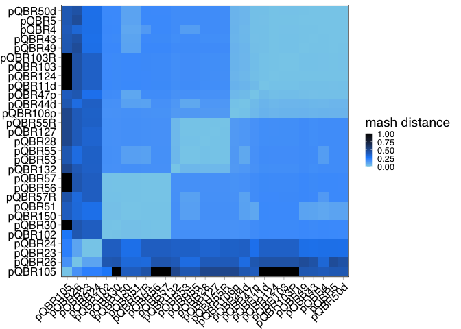

Assembling complete pQBR plasmids using long and short reads
================
revised 2025

## Overview of approach

The plasmids were sequenced inside *P. putida* UWC1, a derivative of *P.
putida* KT2440. Initial Illumina sequencing was performed by MicrobesNG
and provided by Damian Rivett (Manchester Metropolitan University).
These data were analysed in a preliminary attempt to generate closed
plasmid sequences as follows:

1.  Map all reads against the reference Pseudomonas chromosomes using
    `bwa-mem` 0.7.17-r1188.
2.  Collect all reads that did not map to the chromosome and assemble
    *de novo* using SPAdes v3.15.5 with k-mer length of 21, 33, 55, 77.
3.  Long (\>5kb), deep (\>10x coverage) contigs were identified as
    putative pQBR plasmid contigs, and were used for initial comparative
    analysis.

Note that this analysis struggles with plasmids which have regions
matching the *P. putida* UWC1 chromosome (see [Hall et
al. 2015](https://pubmed.ncbi.nlm.nih.gov/25969927/)).

Alongside this analysis, putative plasmids were identified by the whole
genome *de novo* SPAdes assemblies that were provided by MicrobesNG by
visualising the assembly graphs in
[Bandage](https://rrwick.github.io/Bandage/) and identifying and
extracting closed circular contigs.

For plasmids that did not produced closed genomes by either of these
methods, we followed up with ONT sequencing of pools of samples,
grouping distinct plasmids based on the Illumina contigs, to provide
scaffolds that could then be polished with the Illumina reads.

Note: intermediate files are not included in the GitHub.

### Preliminary analysis: assemble unmapped reads

Map reads against reference Pseudomonas chromosomes, extract and
assemble unmapped reads.

``` bash
find ./reads/*_1_trimmed.fastq.gz > 1.tmp
find ./reads/*_2_trimmed.fastq.gz > 2.tmp
awk -v FS="_" '{print $2}' 1.tmp > n.tmp
paste n.tmp 1.tmp 2.tmp > ctrlsamp.txt
rm *.tmp

# make directories for outputs

mkdir ./unmapped_assemblies
mkdir ./unmapped_reads

REF=./ref/SBW25_KT2440_chromosomes.fasta
r1=./scratch/R1.fastq.gz
r2=./scratch/R2.fastq.gz

# use the iteration file to go through for each sample:
#  map using BWA, use samtools to take reads that don't map
#  assemble these reads using SPAdes

cat ctrlsamp.txt | while read SAMPLE R1 R2
do
echo "---- NEXT SAMPLE IS ${SAMPLE} ----"
bwa mem $REF $R1 $R2 \
  | samtools view -hb \
  | samtools sort \
  > mapped.bam

samtools index mapped.bam

samtools view -hf 4 mapped.bam \
  | awk '$3=="\*" {print $1}' \
  | uniq \
  > ./unmapped_reads/${SAMPLE}_unmapped.txt

# get the corresponding reads from the fastq files
seqtk subseq $R1 ./unmapped_reads/${SAMPLE}_unmapped.txt | gzip - > $r1
seqtk subseq $R2 ./unmapped_reads/${SAMPLE}_unmapped.txt | gzip - > $r2

# Assemble
spades.py -o ./unmapped_assemblies/${SAMPLE} \
  -k 21,33,55,77 --careful \
  -1 $r1 -2 $r2
done
```

The output files are in the scaffolds.fasta file in each output
directory.

First, see how many contigs (and what size) per plasmid. Make a summary
file that contains plasmid name, contig number, length, and coverage.

``` bash
grep "^>" ./unmapped_assemblies/UWC1*/scaffolds.fasta \
  | awk -v FS="[/_]" '{print $0, $4, $6, $8, $10}' > ./unmapped_assemblies/summary.txt
```

Plot data from this summary table.

``` r
summary <- read.table("./unmapped_assemblies/summary.txt", header=FALSE, col.names = c("seq","node","length","cov"))

ggplot(summary, aes(x=log10(length), y=log10(cov), colour=node)) + geom_point() + facet_wrap(~seq) +
  geom_hline(yintercept=log10(10), linetype="dotted") + geom_vline(xintercept=log10(5000), linetype="dotted")
```

<!-- -->

This gives a good overview summary. It shows that for some samples,
there are just one or two contigs that are big, and have reasonable
coverage. These look most promising. Other samples have not assembled so
well. Note there were two non-pQBR plasmids included in the sequencing
run, UWC1UG451 and UWC1UG452, that are not analysed further.

How long are the assemblies for each sample?

``` r
summary %>% group_by(seq) %>% 
  summarise(n_contigs = n(),
    total_length = sum(length), 
            min_cov = min(cov), 
            max_cov = max(cov),
            mean_cov = mean(cov),
            median_cov = median(cov)) %>%
  arrange(total_length) %>%
  kable()
```

| seq         | n_contigs | total_length |   min_cov | max_cov |    mean_cov | median_cov |
|:------------|----------:|-------------:|----------:|--------:|------------:|-----------:|
| UWC1pQBR1   |        40 |        54554 |  1.050938 |    2707 |   70.527355 |   2.218342 |
| UWC1pQBR58  |         2 |        73781 | 13.864192 |     614 |  313.932096 | 313.932096 |
| UWC1pQBR132 |         4 |       139163 |  0.894602 |    3667 |  944.063399 |  54.179498 |
| UWC1pQBR55  |         4 |       140164 |  0.876033 |    1336 |  344.172217 |  19.906419 |
| UWC1pQBR28  |         3 |       140514 | 12.820513 |    2801 |  950.272285 |  36.996341 |
| UWC1pQBR53  |        39 |       154114 |  0.838384 |    1945 |   53.023001 |   1.118971 |
| UWC1pQBR105 |        72 |       164041 |  0.663399 |    6833 |  104.733654 |   1.044226 |
| UWC1pQBR57  |         7 |       308528 |  0.839721 |    6964 | 1014.584485 |  25.051282 |
| UWC1pQBR30  |         3 |       310667 |  0.980282 |    2951 | 1003.000029 |  57.019805 |
| UWC1pQBR150 |        12 |       310923 |  0.857143 |    2244 |  193.666878 |   1.278429 |
| UWC1pQBR56  |        13 |       311401 |  0.906915 |    5668 |  441.402890 |   1.048338 |
| UWC1pQBR102 |        11 |       315655 |  0.875445 |    2775 |  258.509623 |   1.038922 |
| UWC1pQBR47  |       122 |       337568 |  0.813620 |   10231 |   86.103346 |   1.447420 |
| UWC1pQBR24  |        19 |       386226 |  0.745575 |    2316 |  133.374671 |  15.022689 |
| UWC1pQBR23  |        16 |       386799 |  0.925532 |   10055 |  660.396746 |  40.833683 |
| UWC1pQBR43  |         4 |       393112 | 87.128439 |    4516 | 1221.934289 | 142.304359 |
| UWC1pQBR50  |         6 |       425289 |  0.860215 |    8759 | 1494.580102 |  54.817217 |
| UWC1pQBR5   |         5 |       425749 |  0.869674 |   12831 | 2583.335300 |  30.538462 |
| UWC1pQBR103 |         6 |       426251 |  1.167785 |   12950 | 2168.297131 |  12.821179 |
| UWC1pQBR4   |        14 |       428654 |  0.908078 |   11437 |  827.814143 |   1.166521 |
| UWC1pQBR11  |        21 |       438268 |  0.872396 |    7015 |  338.571414 |   0.953297 |
| UWC1pQBR106 |       105 |       441287 |  0.803150 |    4587 |   56.057636 |   1.857143 |
| UWC1pQBR49  |         8 |       449073 |  0.886957 |    8773 | 1151.128131 |  56.026832 |
| UWC1pQBR124 |       143 |       485914 |  0.848315 |    4741 |   37.140937 |   1.064417 |
| UWC1pQBR26  |        60 |       577309 |  0.946203 |    9410 |  222.874736 |  50.743658 |
| UWC1pQBR51  |       161 |       696326 |  0.711921 |    4885 |   32.958241 |   2.379043 |
| UWC1pQBR127 |       956 |      1115580 |  0.810277 |    6248 |    8.988482 |   1.365425 |
| UWC1pQBR8   |      1127 |      1380714 |  0.613636 |    3651 |    4.991678 |   1.464799 |

For each assembly, pull out the big (\>5 kb) high coverage (\>10x)
contigs.

Plot the size of the assemblies when just these contigs are included.

``` r
summary %>% filter(length > 5000 & cov > 10 & !(seq %in% c("UWC1UG451", "UWC1UG452"))) %>%
  mutate(label = gsub("UWC1(pQBR[0-9]+)", "\\1", seq)) %>%
  group_by(label) %>%
  summarise(total_length = sum(length)) %>%
  ggplot(aes(x=reorder(label, total_length), y=total_length)) +
  geom_bar(stat="identity") + scale_x_discrete(name = "") + theme_pub() +
  labs(y="total length of big high-coverage contigs") +
  theme(axis.text.x = element_text(angle=45, hjust=1))
```

<!-- -->

Pull out these contigs.

``` bash
mkdir ./unmapped_assemblies/long_deep_unmapped

cat ctrlsamp.txt | while read SAMPLE R1 R2 
do
awk -v sam="$SAMPLE" '$1 == sam && $3 > 5000 && $4 > 10 {print $2}' \
  ./unmapped_assemblies/summary.txt \
  | sed 's/^/NODE_/' | sed 's/$/_/' > nodes.tmp
grep -f nodes.tmp ./unmapped_assemblies/${SAMPLE}/scaffolds.fasta \
  | sed 's/>//g' \
  > nodenames.tmp
seqtk subseq ./unmapped_assemblies/${SAMPLE}/scaffolds.fasta nodenames.tmp \
  | sed "s|>|>${SAMPLE}_|" \
  > ./unmapped_assemblies/long_deep_unmapped/${SAMPLE}_unmapped_assembly.fasta
done
```

Calculate mash distances between all sequences. For this, sequences
within each .fasta file need to be concatenated. Also output a file that
includes details on the number of nodes for each sequence.

``` bash
grep "UWC1pQBR" ctrlsamp.txt | while read SAMPLE R1 R2 
do
echo ">${SAMPLE}_unmapped_assembly" >> ./ref/ldu_pQBR.fasta
grep -v "^>" ./unmapped_assemblies/long_deep_unmapped/${SAMPLE}_unmapped_assembly.fasta \
| tr -d "\n" | fold >> ./unmapped_assemblies/ldu_pQBR.fasta
echo "\n" >> ./unmapped_assemblies/ldu_pQBR.fasta
done

grep "UWC1pQBR" ctrlsamp.txt | while read SAMPLE R1 R2 
do
grep "^>" ./unmapped_assemblies/long_deep_unmapped/${SAMPLE}_unmapped_assembly.fasta \
  | awk -v sam=$SAMPLE -v FS="_" '{print sam, $3, $5, $7}'
done > ./unmapped_assemblies/ldu_pQBR_details.txt
```

What are the details on the numbers of nodes per sequence?

``` r
pqbr_details <- read.table("./unmapped_assemblies/ldu_pQBR_details.txt",
                           col.names=c("plasmid","node_number","length","coverage"))

pqbr_details %>% group_by(plasmid) %>%
  summarise(number_of_nodes = n(),
            max_length = max(length),
            min_length = min(length),
            mean_coverage = mean(coverage)) %>%
  kable()
```

| plasmid     | number_of_nodes | max_length | min_length | mean_coverage |
|:------------|----------------:|-----------:|-----------:|--------------:|
| UWC1pQBR1   |               1 |       9878 |       9878 |      33.32211 |
| UWC1pQBR102 |               1 |     312323 |     312323 |      35.43129 |
| UWC1pQBR103 |               1 |     425168 |     425168 |      19.64236 |
| UWC1pQBR105 |               6 |      63130 |       7667 |      81.77337 |
| UWC1pQBR106 |               5 |      53387 |       5674 |      36.80394 |
| UWC1pQBR11  |               2 |     320086 |     110166 |      21.81896 |
| UWC1pQBR124 |               2 |     324264 |      99013 |      83.47026 |
| UWC1pQBR127 |               7 |     161015 |       5033 |      77.38717 |
| UWC1pQBR132 |               1 |     138541 |     138541 |      41.35900 |
| UWC1pQBR150 |               1 |     307116 |     307116 |      36.27496 |
| UWC1pQBR23  |               5 |     167665 |       7593 |      48.49636 |
| UWC1pQBR24  |               6 |     145724 |       7576 |      20.51830 |
| UWC1pQBR26  |              16 |     140175 |       5164 |      52.45696 |
| UWC1pQBR28  |               1 |     140281 |     140281 |      36.99634 |
| UWC1pQBR30  |               1 |     310157 |     310157 |      57.01980 |
| UWC1pQBR4   |               3 |     214260 |      38950 |      36.53968 |
| UWC1pQBR43  |               2 |     256230 |     136726 |      90.86858 |
| UWC1pQBR47  |               1 |     252601 |     252601 |      81.73491 |
| UWC1pQBR49  |               4 |     175972 |      42153 |      55.64029 |
| UWC1pQBR5   |               1 |     424612 |     424612 |      53.25670 |
| UWC1pQBR50  |               3 |     374297 |      11529 |      58.18543 |
| UWC1pQBR51  |               2 |     164905 |     142276 |      30.52411 |
| UWC1pQBR53  |               2 |      73086 |      66141 |      32.78773 |
| UWC1pQBR55  |               1 |     139190 |     139190 |      38.90255 |
| UWC1pQBR56  |               1 |     307407 |     307407 |      46.41393 |
| UWC1pQBR57  |               1 |     307276 |     307276 |      63.91373 |
| UWC1pQBR58  |               1 |      73703 |      73703 |      13.86419 |
| UWC1pQBR8   |               1 |       8488 |       8488 |      20.53846 |

Calculate mash distances. Use a high value for sketch size to detect
distant similarities between sequences.

- S = default seed function
- s = default sketch size
- k = default kmer size

``` bash
mash sketch ./unmapped_assemblies/ldu_pQBR.fasta -i -S 42 -s 100000 -k 21 -p 4 -o ./unmapped_assemblies/ldu_pQBR.msh
mash triangle ./unmapped_assemblies/ldu_pQBR.msh -i -k 21 -p 4 > ./unmapped_assemblies/ldu_pQBR_mash.dst
```

Plot as a heatmap in R. Make distance matrix square

``` r
pqbr_dist <- read.table("./unmapped_assemblies/ldu_pQBR_mash.dst", fill=TRUE, skip=1,
                        col.names=c("V0",paste("V", 1:28, sep="")))
pqbr_dist$V0 <- gsub("UWC1(pQBR[0-9]+)_unmapped_assembly", "\\1", pqbr_dist$V0)
pqbr_dist <- column_to_rownames(pqbr_dist, "V0")
pqbr_distmat <- as.dist(pqbr_dist, upper=TRUE, diag=TRUE)
pqbr_sqmat <- as.matrix(pqbr_distmat)

plasmid_order <- colnames(pqbr_sqmat)

pqbr_dist_df <- pqbr_sqmat %>% as.data.frame() %>%
  mutate(a = plasmid_order) %>%
  pivot_longer(-a, names_to = "b", values_to = "mash_distance") %>%
  filter(!is.na(mash_distance)) %>%
  mutate(a = factor(a, levels=plasmid_order), b=factor(b, levels=plasmid_order))

ggplot(data=pqbr_dist_df) +
  geom_tile(aes(x=a, y=b, fill=mash_distance)) +
  scale_fill_gradient(low = "dodgerblue", high = "black")
```

<!-- -->

Cluster according to similarities.

``` r
pqbr_dendro <- as.dendrogram(hclust(pqbr_distmat))

dendro_plot <- ggdendrogram(data = pqbr_dendro, rotate = TRUE)

plasmid_reorder <- order.dendrogram(pqbr_dendro)

(short_read_heatmap <- pqbr_dist_df %>%
  mutate(a = factor(a, levels=plasmid_order[plasmid_reorder]), 
         b = factor(b, levels=plasmid_order[plasmid_reorder])) %>%
  ggplot() +
  geom_tile(aes(x=a, y=b, fill=mash_distance)) +
  scale_fill_gradientn(colours = c("skyblue","dodgerblue","black"), values=c(0,0.25,1), name = "mash distance") +
  theme(axis.text.x = element_text(angle=45, hjust=1), axis.title.x = element_blank(), axis.title.y = element_blank(), 
        legend.position="right"))
```

<!-- -->

``` r
png(file = "./figs/short_read_heatmap.png", height=6, width=8, units="in", res=300)
short_read_heatmap
dev.off()
```

    ## quartz_off_screen 
    ##                 2

This gives a good overview of the plasmids.

#### Interpretation of preliminary analysis

There are five main clusters of sequences that show high internal
similarity: pQBR103-like (Group I), pQBR23-like (Group II), pQBR55-like
(Group III), pQBR57-like (Group IV), pQBR1-like (Group V), and pQBR105
(an outlier).

However, there are also some other observations, supported by manual
examination of the long, deep, unmapped assemblies, and the plots above.

**pQBR1**: Illumina sequencing indicated no plasmid present. Instead,
and in contrast to the ~70-kb plasmid referred to by [Lilley et
al. (1996)](https://doi.org/10.1111/j.1574-6941.1996.tb00320.x), an
integrated analysis of the assembly of all and unmapped reads shows a
9.9 kb sequence that has integrated into the chromosome. This suggests
that the stock strain has lost the plasmid but kept the transposon, as
described in various lab studies with other pQBR plasmids. We were not
able to detect conjugation in the lab, further supporting our inference
that the plasmid has been lost.

**pQBR8**: Illumina sequencing indicated low coverage for regions of
interest, except for a chromsomal-matching contig encoding an integrated
*mer* operon, suggesting that the plasmid was in the process of being
lost when the sample was sequenced. We were not able to detect
conjugation in the lab, further supporting our inference that the
plasmid is unstable/lost.

**pQBR58**: Illumina sequencing indicated low coverage for regions of
interest (except for a short contig encoding a *mer* operon), suggesting
that the plasmid was in the process of being lost when the sample was
sequenced. We were not able to detect conjugation in the lab, further
supporting our inference that the plasmid is unstable/lost.

**pQBR127**: MASH distance clustering indicated that this sample matched
both Group I and Group III sequences, which may indicate that more than
one plasmid is present in the sample.

### Resolving sequences

Sequences that were not fully resolved by either the assembly of all
reads, or the assembly of unmapped reads, were subject to ONT sequencing
by Plasmidsaurus.

The long-read contigs that matched each plasmid were identified by
BLASTing the ONT assemblies for each sample against the contigs
assembled by Illumina. The long-read contigs were extracted, named, and
placed in `./contigs` for polishing.

Some manual analysis was required for the following, possibly due to
sequence loss, chromosome integration, multiple plasmids, or some
combination of the above. This requires further analysis.

#### pQBR26 (Group II)

pQBR26 was previously identified as a Group II plasmid, like pQBR23 and
pQBR24. However, though transconjugants into *P. fluorescens* SBW25 were
easily generated, they did not give a positive PCR product for the
primers designed for Group II plasmids. Analysis of the Illumina reads
showed another contig that also contained a predicted *merA* gene, and
primers designed against this contig did give a positive product when
applied to transconjugant colonies. Long-read sequencing of UWC1(pQBR26)
showed two extrachromosomal replicons, one of which resembled pQBR23
(394 kb) but had a copy number of \<1, and the other with a copy number
of ~1 that matched the contig that was capable of conjugating (229 kb).
We infer that UWC1(pQBR26) contained two different *mer* plasmids, one
of which is less stable and/or less conjugative than the other, and the
229-kb conjugative plasmid is indicated as the canonical pQBR26 plasmid.

#### pQBR11 (Group I)

pQBR11 produced Group I-like contigs when the short reads were analysed.
However, the sample did not resolve in the long read sequencing. The
sequence therefore remains as a draft (pQBR11d) based on the Illumina
unmapped read assembly.

#### pQBR43 (Group I)

This sequence didn’t fully resolve owing to a duplicate sequence in the
chromosome. Two possibilities: both the chromosome and the plasmid
contain the same duplicated element (likely a Tn6290 transposon) but
remain separate replicons, or the plasmid has integrated into the
chromosome, flanked by copies of the duplication.

Resolving this is complex, as the duplicated element is 42 kb long and
there are insufficient reads overlapping the junction.

A path containing the plasmid contigs and Tn6290 transposon was
extracted for analysis.

#### pQBR50 (Group I)

This sequence didn’t fully resolve owing to duplicate sequences in the
chromosome and multiple copies of Tn6290. The mean depth of the
chromosome (from the Illumina sequencing) was ~21x, the mean depth of
Tn6290 was ~130x! Suggesting there are between 6 and 7 copies of Tn6290
(5-6 of which likely on or associated with the plasmid). Interestingly,
this plasmid seems to be at approximately 2x copy number of the
chromosome in the Illumina sequencing, but a bit lower in the ONT
sequencing.

As with pQBR43, this couldn’t be resolved due to the length of Tn6290,
even with the long-read sequencing.

The sequence therefore remains a draft (pQBR50d) based on conjoining the
largest contigs from the ONT sequencing.

``` bash
awk -v RS=">" '$1 ~ /^contig_3/ {print RS $0}' ./working/pQBR50_consensus_cov.fna \
  | revseq -filter > ./working/pQBR50_consensus_contigs.fasta
  
awk -v RS=">" '$1 ~ /^contig_6/ {print RS $0}' ./working/pQBR50_consensus_cov.fna \
  >> ./working/pQBR50_consensus_contigs.fasta

union ./working/pQBR50_consensus_contigs.fasta -filter \
  | sed 's/>.*/>pQBR50d/g' > ./working/pQBR50d_contig.fasta
```

These were polished as described below.

#### pQBR127 (“Group IV”)

Analysis of short-read sequencing suggested that this strain harboured
replicons that both resembled Group I and Group III plasmids. The
bandage plot shows matches to pQBR55 (Group III, blue) and pQBR103
(Group I, green).

<figure>

<figcaption aria-hidden="true">pQBR127_bandage.png</figcaption>
</figure>

Performed long-read sequencing to resolve, which showed a distinct Group
III replicon and no Group I replicon. Infer that two plasmids were
present in the Illumina sequencing, of which only one remains in our
sample.

#### pQBR47 (Group I)

This sequence didn’t fully resolve owing to a duplicate Tn6290 sequence,
and the sequence is assembled as a single contig including plasmid and
chromosome. Perhaps the plasmid has also integrated into the chromosome,
but as above, resolving this with current sequencing data is not
straightforward.

The whole contig was used for downstream analysis, and the
plasmid-specific portion was extracted (see below).

#### pQBR106 (ND)

Similarly, this sequence didn’t fully resolve, in a similar manner to
pQBR47, with a single contig including the chromosome.

The whole contig was used for downstream analysis, and the
plasmid-specific portion was extracted (see below).

#### pQBR44 (Group I)

pQBR44 was previously sequenced in [Hall et
al. 2015](https://pubmed.ncbi.nlm.nih.gov/25969927/). It was not
resequenced here. The two sequences identified could not be resolved,
due to transposon insertions.

It was downloaded and the two contigs were concatenated (pQBR44d).

``` bash
curl "https://eutils.ncbi.nlm.nih.gov/entrez/eutils/efetch.fcgi?db=nucleotide&amp;id=CDLQ010000002.1&amp;rettype=fasta" \
  > ./working/pQBR44_1.fasta
  
curl "https://eutils.ncbi.nlm.nih.gov/entrez/eutils/efetch.fcgi?db=nucleotide&amp;id=CDLQ010000001.1&amp;rettype=fasta" \
  >> ./working/pQBR44_1.fasta
  
union -sequence ./working/pQBR44_1.fasta -filter \
  | sed 's/>.*/>pQBR44d/g' > ./polished/pQBR44d.fasta
```

### Polishing

Polished sequences using
[PolyPolish](https://github.com/rrwick/Polypolish).

Align reads to draft genomes with bwa and run PolyPolish.

``` bash
find ./contigs -name "pQBR*" -type f |
  sed 's/.*pQBR/pQBR/g' | sed 's/_contig.fasta//g' \
  > long_reads_draft.txt

find ./illumina/*_1_trimmed.fastq.gz > 1.tmp
find ./illumina/*_2_trimmed.fastq.gz > 2.tmp
awk -v FS="_" '{print $2}' 1.tmp > n.tmp
paste n.tmp 1.tmp 2.tmp > ctrlsamp.txt
rm *.tmp
  
cat long_reads_draft.txt | while read SAMPLE
do
grep "${SAMPLE}_" ./ctrlsamp.txt | while read STR R1 R2
do 
echo "---"
echo "Next plasmid is $SAMPLE"
echo "---"
bwa index ./contigs/${SAMPLE}_contig.fasta
bwa mem -t 16 -a ./contigs/${SAMPLE}_contig.fasta $R1 > alignments_1.sam
bwa mem -t 16 -a ./contigs/${SAMPLE}_contig.fasta $R2 > alignments_2.sam
/pub60/jamesh/bin/polypolish_insert_filter.py --in1 alignments_1.sam --in2 alignments_2.sam \
  --out1 filtered_1.sam --out2 filtered_2.sam
polypolish ./contigs/${SAMPLE}_contig.fasta filtered_1.sam filtered_2.sam > ./polished/${SAMPLE}_polished.fasta
done
done
```

### Orienting/aligning

Checked with blastn and ACT to look for repeated sequences at the ends
of the ‘polished’ assemblies. Direct repeats, particularly from the
Illumina assemblies, likely indicates circularisation. Use
[ccfind](https://github.com/yosuken/ccfind) to identify and remove such
repeats.

``` bash
mkdir ./ccfind

find ./polished -name "*.fasta" -exec basename -- {} .fasta \; \
  | while read FASTA 
  do 
  ccfind ./polished/${FASTA}.fasta ./ccfind/${FASTA}
  done

mkdir ./archive

find ./ccfind/*/result -name "circ.detected.list" -exec wc -l {} \; \
  | awk '$1 == 1 {print $0}' | awk -v FS="/" '{print $3}' \
  | while read PLASMID
  do
  echo $PLASMID
  mv ./polished/${PLASMID}.fasta ./archive/${PLASMID}_withTR.fasta
  cp ./ccfind/${PLASMID}/result/circ.noTR.fasta ./polished/${PLASMID}.fasta
  done
```

Next, orient the sequences so they start at a similar/comparable
position. Use the first coding base of the putative replicase.

- For pQBR57-like (Group IV), use PQBR57_0001 in the reference sequence
  LN713926.
- For pQBR103-like (Group I) this is at 388361 in the reference sequence
  AM235768 (PQBR0445).
- For pQBR55-like (Group III), use the first of the dnaB genes referred
  to in Turner et al. (2002), which is PQBR55_0049.

For the others, do an analysis to check they are oriented correctly
relative to one another.

Create a blastn database of the three above CDS and blast all against it
to find the direction and first base of the corresponding gene in each
assembly.

``` bash
cat ./ref/PQBR55_0049.fasta ./ref/PQBR57_0001.fasta ./ref/pQBR0445.fasta > ./ref/rep.fasta

makeblastdb -in ./ref/rep.fasta -dbtype nucl

find ./polished -name "*.fasta" -exec blastn -query {} -db ./ref/rep.fasta -outfmt 6 \; \
  > ./working/blast_rep.blastn
```

Use this output to realign the sequences using EMBOSS.

``` bash
mkdir ./complete

cat ./working/blast_rep.blastn | while read SEQ MATCH PERC LEN GAP MM QSTART QFIN SSTART SFIN EVAL BITSC
do
let endposf=$QSTART-1
let endposr=$QFIN+1
filename=`echo $SEQ | sed 's/_polypolish/_polished/g'`
seqname=`echo $filename | sed 's/_polished//g'`
if [ $SFIN -lt $SSTART ]
then
echo "$SEQ is in reverse direction"
seqret -sformat1 fasta \
  -osformat2 fasta \
  -sbegin 1 \
  -send ${QFIN} \
  -srev \
  -sequence ./polished/${filename}.fasta \
  -filter > tmp1.fasta
seqret -sformat1 fasta \
  -osformat2 fasta \
  -srev \
  -sbegin1 $endposr \
  -sequence ./polished/${filename}.fasta \
  -filter > tmp2.fasta
cat tmp1.fasta tmp2.fasta \
  | union -filter -osname2 ${seqname} \
  | sed 's/_polypolish//g' \
  > ./complete/${seqname}.fasta  
else
echo "$SEQ is in forward direction"
seqret -sequence ./polished/${filename}.fasta \
  -sformat1 fasta \
  -osformat2 fasta \
  -sbegin ${QSTART} \
  -outseq tmp1.fasta
seqret -sequence ./polished/${filename}.fasta \
  -sformat1 fasta \
  -osformat2 fasta \
  -sbegin 1 \
  -send1 $endposf \
  -outseq tmp2.fasta
cat tmp1.fasta tmp2.fasta \
  | union -filter -osname2 ${seqname} \
  | sed 's/_polypolish//g' \
  > ./complete/${seqname}.fasta
fi
done
```

This gives complete, oriented assemblies for most sequences. Some are
missing due to a lack of blastn matches: the Group II plasmids pQBR23
and pQBR24, pQBR26, pQBR105 (no similar plasmids amongst the groups).

For pQBR23 and pQBR24, these should be oriented to the same point. Run a
quick Prokka annotation and identify a putative replicase.

``` bash
prokka ./polished/pQBR23_polished.fasta -out ./working/pQBR23_annot
```

Finds a putative pair of plasmid replication genes, the first of which
is at position 147660..149189. Extract and blast against pQBR24.

``` bash
awk -v seq="PROKKA_00168" -v RS='>' '$1 == seq {print RS $0}' ./working/pQBR23_annot/PROKKA_12212023.ffn \
  > ./working/pQBR23_repA.fasta
  
makeblastdb -in ./working/pQBR23_repA.fasta -dbtype nucl

blastn -query ./polished/pQBR24_polished.fasta -db ./working/pQBR23_repA.fasta -outfmt 6 \
  >  ./working/pQBR24_rep.blastn
```

Identifies the sequence in pQBR24 at 384040..385569, in reverse. So
385569 is the start of the gene, and 384040 is the end.

``` bash
seqret -sequence ./polished/pQBR23_polished.fasta \
  -sformat1 fasta \
  -osformat2 fasta \
  -sbegin 147660 \
  -outseq tmp1.fasta
seqret -sequence ./polished/pQBR23_polished.fasta \
  -sformat1 fasta \
  -osformat2 fasta \
  -sbegin 1 \
  -send1 147659 \
  -outseq tmp2.fasta
cat tmp1.fasta tmp2.fasta \
  | union -filter -osname2 pQBR23 \
  | sed 's/_polypolish//g' \
  > ./complete/pQBR23.fasta
  
seqret -sequence ./polished/pQBR24_polished.fasta \
  -sformat1 fasta \
  -osformat2 fasta \
  -sbegin 1 \
  -send1 385569 \
  -srev \
  -outseq tmp1.fasta
seqret -sequence ./polished/pQBR24_polished.fasta \
  -sformat1 fasta \
  -osformat2 fasta \
  -sbegin 385570 \
  -srev \
  -outseq tmp2.fasta
cat tmp1.fasta tmp2.fasta \
  | union -filter -osname2 pQBR24 \
  | sed 's/_polypolish//g' \
  > ./complete/pQBR24.fasta
```

Do similar for pQBR26.

``` bash
prokka ./polished/pQBR26.fasta -out ./working/pQBR26_annot
```

Finds a repE-like replicase gene starting as position 112373.

``` bash
seqret -sequence ./polished/pQBR26.fasta \
  -sformat1 fasta \
  -osformat2 fasta \
  -sbegin 112373 \
  -outseq tmp1.fasta
seqret -sequence ./polished/pQBR26.fasta \
  -sformat1 fasta \
  -osformat2 fasta \
  -sbegin 1 \
  -send1 112373 \
  -outseq tmp2.fasta
cat tmp1.fasta tmp2.fasta \
  | union -filter -osname2 pQBR26 \
  | sed 's/_polypolish//g' \
  > ./complete/pQBR26.fasta
```

…and pQBR105.

``` bash
prokka ./polished/pQBR105_polished.fasta -out ./working/pQBR105_annot
```

This couldn’t find a putative replicase, so the sequence was just copied
across.

``` bash
sed 's/_polypolish//g' ./polished/pQBR105_polished.fasta > ./complete/pQBR105.fasta
```

Add ‘R’ to pQBR103, pQBR55, and pQBR57 to indicate these variants have
been resequenced (this was done manually).

Download and re-centre the originally-sequenced pQBR103, pQBR55, and
pQBR57 to analyse alongside.

pQBR103:

``` bash
mkdir ./originals

curl "https://eutils.ncbi.nlm.nih.gov/entrez/eutils/efetch.fcgi?db=nucleotide&amp;id=AM235768&amp;rettype=fasta" \
  > ./originals/pQBR103.fasta

blastn -query ./originals/pQBR103.fasta -db ./ref/rep.fasta -outfmt 6 \
  > pQBR103_rep.blastn
  
# check and align
# 388361    389491

seqret -sequence ./originals/pQBR103.fasta \
  -sformat1 fasta \
  -osformat2 fasta \
  -sbegin 388361 \
  -outseq tmp1.fasta
seqret -sequence ./originals/pQBR103.fasta \
  -sformat1 fasta \
  -osformat2 fasta \
  -sbegin 1 \
  -send1 388360 \
  -outseq tmp2.fasta
cat tmp1.fasta tmp2.fasta \
  | union -filter -osname2 pQBR103 \
  > ./originals/pQBR103.fasta
  
gzip ./originals/pQBR103.fasta
```

pQBR57:

``` bash
curl "https://eutils.ncbi.nlm.nih.gov/entrez/eutils/efetch.fcgi?db=nucleotide&amp;id=LN713926&amp;rettype=fasta" \
  > ./originals/pQBR57.fasta

blastn -query ./originals/pQBR57.fasta -db ./ref/rep.fasta -outfmt 6 \
  > pQBR57_rep.blastn
  
# 542

seqret -sequence ./originals/pQBR57.fasta \
  -sformat1 fasta \
  -osformat2 fasta \
  -sbegin 542 \
  -outseq tmp1.fasta
seqret -sequence ./originals/pQBR57.fasta \
  -sformat1 fasta \
  -osformat2 fasta \
  -sbegin 1 \
  -send1 541 \
  -outseq tmp2.fasta
cat tmp1.fasta tmp2.fasta \
  | union -filter -osname2 pQBR57 \
  > ./originals/pQBR57.fasta
  
gzip ./originals/pQBR57.fasta
```

pQBR55:

``` bash
curl "https://eutils.ncbi.nlm.nih.gov/entrez/eutils/efetch.fcgi?db=nucleotide&amp;id=LN713927&amp;rettype=fasta" \
  > ./originals/pQBR55.fasta

blastn -query ./originals/pQBR55.fasta -db ./ref/rep.fasta -outfmt 6 \
  > pQBR55_rep.blastn
  
# 34006

seqret -sequence ./originals/pQBR55.fasta \
  -sformat1 fasta \
  -osformat2 fasta \
  -sbegin 34006 \
  -outseq tmp1.fasta
seqret -sequence ./originals/pQBR55.fasta \
  -sformat1 fasta \
  -osformat2 fasta \
  -sbegin 1 \
  -send1 34005 \
  -outseq tmp2.fasta
cat tmp1.fasta tmp2.fasta \
  | union -filter -osname2 pQBR55 \
  > ./originals/pQBR55.fasta
  
gzip ./originals/pQBR55.fasta
```

Annotate with Bakta version 1.8.2. Database is version 5.0 full.

Use metagenome mode to ensure that the same CDS prediction model is used
across all of the plasmids, to aid identification of homologues on
related sequences.

``` bash
find ./complete -name "pQBR*.fasta" -exec gzip {} \;

cp ./originals/*.fasta.gz ./complete

find ./complete -name "pQBR*.fasta.gz" -exec basename -- {} .fasta.gz \; \
  > ./list_of_pQBR_plasmids.txt
  
cat list_of_pQBR_plasmids.txt |
while read PLASMID
do
bakta --db /pub60/jamesh/db --prefix ${PLASMID} \
  --complete \
  --locus ${PLASMID}_contig \
  --verbose \
  --output ./bakta_a/${PLASMID} \
  --plasmid ${PLASMID} \
  --threads 128 \
  --locus-tag ${PLASMID^^} \
  --meta \
  ./complete/${PLASMID}.fasta.gz
done
```

These annotations (bakta_annotated) used for subsequent analyses.

Make a table of information for each sequence:

``` bash
grep "Length: " ./bakta_annotated/*/*.txt \
  | sed 's:./bakta_annotated/::g' | sed 's;/pQBR[0-9Rpd]*.txt:Length: ;\t;g' | sort -n -k2
```

    ## pQBR106p 98802
    ## pQBR132  139938
    ## pQBR127  140415
    ## pQBR55R  140432
    ## pQBR28   141505
    ## pQBR44d  143197
    ## pQBR53   157450
    ## pQBR55   157450
    ## pQBR105  161330
    ## pQBR26   228742
    ## pQBR47p  293223
    ## pQBR56   307330
    ## pQBR57   307330
    ## pQBR30   310323
    ## pQBR57R  324348
    ## pQBR102  334884
    ## pQBR150  366385
    ## pQBR51   366385
    ## pQBR23   393597
    ## pQBR24   393604
    ## pQBR124  424568
    ## pQBR103  425094
    ## pQBR103R 425094
    ## pQBR11d  430820
    ## pQBR5    466604
    ## pQBR43   510643
    ## pQBR4    525650
    ## pQBR50d  563271
    ## pQBR49   587656
    ## pQBR106  6320937
    ## pQBR47   6515328

Shows that pQBR106 and pQBR47 are abnormally large. The specific
plasmid-encoding portions were identified using ACT with comparison to
the KT2440 chromosome.

Note that the concatenation between pQBR44 contigs is at position
92628-92629 in pQBR44d.

#### pQBR47 plasmid-specific portion

The plasmid-specific portion, with a single integrated copy of Tn6290,
goes from position `6501702..6515328` and `1..279596`, as identified by
ACT.

``` bash
seqret -sequence ./bakta_annotated/pQBR47/pQBR47.fna \
  -sformat1 fasta \
  -osformat2 fasta \
  -sbegin 1 \
  -send 279596 \
  -outseq ./working/tmp1.fasta
seqret -sequence ./bakta_annotated/pQBR47/pQBR47.fna \
  -sformat1 fasta \
  -osformat2 fasta \
  -sbegin 6501702 \
  -send1 6515328 \
  -outseq ./working/tmp2.fasta

cat ./working/tmp1.fasta ./working/tmp2.fasta \
 > ./working/pQBR47p.fasta
```

Sequence was manually renamed and run through bakta.

``` bash
PLASMID=pQBR47p

bakta --db /pub60/jamesh/db --prefix ${PLASMID} \
  --locus ${PLASMID}_contig \
  --verbose \
  --output ./bakta_a/${PLASMID} \
  --plasmid ${PLASMID} \
  --threads 128 \
  --locus-tag ${PLASMID^^} \
  --meta \
  pQBR47p.fasta
```

#### pQBR106 plasmid-specific portion

The plasmid-specific portion goes from position `1..14487` (running into
a copy of Tn6290) and `6236623` (running from a copy of Tn6290) to the
end of the contig at `6320937`. The remaining plasmid-specific part of
pQBR106 is much smaller than it is for pQBR47.

``` bash
seqret -sequence ./bakta_annotated/pQBR106/pQBR106.fna \
  -sformat1 fasta \
  -osformat2 fasta \
  -sbegin 1 \
  -send 14487 \
  -outseq ./working/tmp1.fasta
seqret -sequence ./bakta_annotated/pQBR106/pQBR106.fna \
  -sformat1 fasta \
  -osformat2 fasta \
  -sbegin 6236623 \
  -send1 6320937 \
  -outseq ./working/tmp2.fasta

cat ./working/tmp1.fasta ./working/tmp2.fasta \
 > ./working/pQBR106p.fasta
```

Sequence was manually renamed and run through bakta.

``` bash
PLASMID=pQBR106p

bakta --db /pub60/jamesh/db --prefix ${PLASMID} \
  --locus ${PLASMID}_contig \
  --verbose \
  --output ./bakta_a/${PLASMID} \
  --plasmid ${PLASMID} \
  --threads 128 \
  --locus-tag ${PLASMID^^} \
  --meta \
  pQBR106p.fasta
```

Annotated sequences for downstream analysis are in the subdirectory
`./bakta_annotated`.

Note that the suffix ‘R’ indicates ‘resequenced’, ‘d’ indicates ‘draft’
(i.e. manual editing/concatenation of contigs necessary to generate the
final sequence, as described above), and ‘p’ indicates the
plasmid-specific portion of a (potentially) chromosomally-integrated
assembly.

### Sequence distance/similarity plot for assembled plasmids

Generate a heatmap like that above, but just for the assembled/annotated
plasmids used in downstream analyses.

``` bash
find ./bakta_annotated/*/*.fna | awk -v FS="/" '{print $3}' > ./1_sketches/annotated_plasmids.list

cat ./1_sketches/annotated_plasmids.list | while read PLASMID
do
mash sketch ./bakta_annotated/${PLASMID}/${PLASMID}.fna -S 42 -s 100000 -k 21 -p 4 -o ./1_sketches/${PLASMID}.msh
done

mash triangle ./1_sketches/pQBR*.msh -i -k 21 -p 4 > ./1_sketches/bakta_annotated_mash.dst
```

Plot as a heatmap in R. Make distance matrix square

``` r
pqbra_dist <- read.table("./1_sketches/bakta_annotated_mash.dst", fill=TRUE, skip=1,
                        col.names=c("V0",paste("V", 1:31, sep=""))) 
pqbra_dist$V0 <- gsub(".*/(pQBR[0-9Rpd]+)/.*.fna", "\\1", pqbra_dist$V0)
pqbra_dist <- column_to_rownames(pqbra_dist, "V0")
pqbra_distmat <- as.dist(pqbra_dist, upper=TRUE, diag=TRUE)
pqbra_sqmat <- as.matrix(pqbra_distmat)

plasmida_order <- colnames(pqbra_sqmat)

pqbra_dist_df <- pqbra_sqmat %>% as.data.frame() %>%
  mutate(a = plasmida_order) %>%
  pivot_longer(-a, names_to = "b", values_to = "mash_distance") %>%
  filter(!is.na(mash_distance)) %>%
  mutate(a = factor(a, levels=plasmida_order), b=factor(b, levels=plasmida_order))

ggplot(data=pqbra_dist_df) +
  geom_tile(aes(x=a, y=b, fill=mash_distance)) +
  scale_fill_gradient(low = "dodgerblue", high = "black")
```

<!-- -->

Cluster according to similarities.

``` r
pqbra_dendro <- as.dendrogram(hclust(pqbra_distmat))

plasmida_reorder <- order.dendrogram(pqbra_dendro)

(annotated_heatmap <- pqbra_dist_df %>%
  mutate(a = factor(a, levels=plasmida_order[plasmida_reorder]), 
         b = factor(b, levels=plasmida_order[plasmida_reorder])) %>%
  ggplot() +
  geom_tile(aes(x=a, y=b, fill=mash_distance)) +
  scale_fill_gradientn(colours = c("skyblue","dodgerblue","black"), values=c(0,0.25,1), name = "mash distance") +
  theme(axis.text.x = element_text(angle=45, hjust=1), axis.title.x = element_blank(), axis.title.y = element_blank(), 
        legend.position="right"))
```

<!-- -->

Remove pQBR47 and pQBR106 from the heatmap, as these erroneously include
the whole chromosome as well.

``` r
(annotated_heatmap_edit <- pqbra_dist_df %>%
   filter(!(a %in% c("pQBR47", "pQBR106")) & !(b %in% c("pQBR47", "pQBR106"))) %>%
   mutate(a = factor(a, levels=plasmida_order[plasmida_reorder]), 
          b = factor(b, levels=plasmida_order[plasmida_reorder])) %>%
   ggplot() +
   geom_tile(aes(x=a, y=b, fill=mash_distance)) +
   scale_fill_gradientn(colours = c("skyblue","dodgerblue","black"), values=c(0,0.25,1), name = "mash distance") +
   theme(axis.text.x = element_text(angle=45, hjust=1), axis.title.x = element_blank(), axis.title.y = element_blank(), 
         legend.position="right"))
```

<!-- -->

``` r
png(file = "./figs/annotated_heatmap_edit.png", height=6, width=8, units="in", res=300)
annotated_heatmap_edit
dev.off()
```

    ## quartz_off_screen 
    ##                 2

------------------------------------------------------------------------

**[Back to index.](../README.md)**
