Analysis of related pQBR plasmids
================
revised 2025

## Pangenome analysis

### Group I plasmids (pQBR103-like)

#### Identify similar plasmids from databases using MASH

Screen pseudomonasdb and plsdb for related plasmids in complete and
draft *Pseudomonas* genomes. The mash 2_sketches for these databases
were with kmer size of 21 and sketch size of 10,000.

- PLSDB version 2023_11_23_v2
- PseudomonasDB version 22.1 (2023-10-06)

``` bash
mash sketch -i -s 10000 -o pseudomonas_complete.fasta.msh pseudomonas_complete.fasta
mash sketch -i -s 10000 -o pseudomonas_draft.fasta.msh pseudomonas_draft.fasta
mash sketch -i -s 10000 -o plsdb.fasta.msh plsdb.fna.gz
```

Preliminary results indicated frequent hits to the transposon Tn5042
rather than to the plasmid backbone. Create a ‘backbone’ sequence,
lacking Tn5042, by removing sequence from 412026 (Transposase) to 418657
(merR regulator).

``` bash
mkdir ./MASH_sketches

seqret -sequence ./bakta_a/pQBR103/pQBR103.fna \
  -sformat1 fasta \
  -osformat2 fasta \
  -sbegin 1 \
  -send1 412026 \
  -outseq tmp1.fasta
seqret -sequence ./bakta_a/pQBR103/pQBR103.fna \
  -sformat1 fasta \
  -osformat2 fasta \
  -sbegin 418657 \
  -send1 425094 \
  -outseq tmp2.fasta
cat tmp1.fasta tmp2.fasta \
  | union -filter -osname2 pQBR103_backbone \
  > ./MASH_sketches/pQBR103_backbone.fasta
  
rm tmp*.fasta
```

Sketch sequence and run against databases. Include also the
[RefSeq88](https://mash.readthedocs.io/en/latest/data.html) database
provided by mash.

``` bash
mash sketch -s 10000 ./MASH_sketches/pQBR103_backbone.fasta \
  -o ./MASH_sketches/pQBR103_backbone.msh
  
mash dist -p 64 \
  ./MASH_sketches/pQBR103_backbone.msh \
  ../MASH_DBS/refseq.genomes+plasmid.k21s1000.msh \
  > ./MASH_sketches/pQBR103b_refseq_mash_results.txt

mash dist -p 64 \
  ./MASH_sketches/pQBR103_backbone.msh \
  ../MASH_DBS/pseudomonas_complete.fasta.msh \
  > ./MASH_sketches/pQBR103b_ps_comp_mash_results.txt
  
mash dist -p 64 \
  ./MASH_sketches/pQBR103_backbone.msh \
  ../MASH_DBS/pseudomonas_draft.fasta.msh \
  > ./MASH_sketches/pQBR103b_ps_draft_mash_results.txt  
  
mash dist -p 64 \
  ./MASH_sketches/pQBR103_backbone.msh \
  ../MASH_DBS/plsdb.fasta.msh \
  > ./MASH_sketches/pQBR103b_plsdb_mash_results.txt  
```

Note that all the MASH results described in this document here were
trimmed to only include matches with e-value \< 1e-20 when transferring
off the server to save space
(`awk '$4 < 1e-20 {print $0}' $RESULTS > ../${RESULTS}`).

Pull out sequences and aggregate. Extract sequences with e-value \<
1e-100 and pairwise BLAST, to identify a minimum level of horizontal
coverage.

``` bash
mkdir -p ./2_relatives/matches

awk '$4 < 1e-100 {print $2}' ./2_sketches/pQBR103b_ps_draft_mash_results.txt \
  | sed 's/_[0-9]*//g' | sort | uniq | while read CODE
  do
  grep "^$CODE" ./2_sketches/draft_keylist_pseudomonas.csv \
    | awk -v FS="," '{print $2}' | sort | uniq | while read GENOME
    do
    grep "$GENOME" ./ref/strain_summary.txt \
      >> ./2_relatives/matches/pQBR103b_ps_draft_matches.txt
  done
  done
  
awk '$4 < 1e-100 {print $2}' ./2_sketches/pQBR103b_ps_comp_mash_results.txt \
  | sed 's/_[0-9]*//g' | sort | uniq | while read CODE
  do
  grep "^$CODE" ./2_sketches/complete_keylist_pseudomonas.csv \
    | awk -v FS="," '{print $2}' | sort | uniq | while read GENOME
    do
    grep "$GENOME" ./ref/strain_summary.txt \
      >> ./2_relatives/matches/pQBR103b_ps_comp_matches.txt
  done
  done

mkdir ./2_relatives/seqs
    
awk -v FS="\t" '{print $24, $25}' ./2_relatives/matches/pQBR103b_ps_draft_matches.txt | while read DIR FILE
do 
wget ${DIR}/${FILE} -O ./2_relatives/pQBR103_seqs/${FILE}
done

awk -v FS="\t" '{print $24, $25}' ./2_relatives/matches/pQBR103b_ps_comp_matches.txt | while read DIR FILE
do 
wget ${DIR}/${FILE} -O ./2_relatives/pQBR103_seqs/${FILE}
done

awk '$4 < 1e-100 {print $2}' ./2_sketches/pQBR103b_plsdb_mash_results.txt | while read GB
do
curl "https://eutils.ncbi.nlm.nih.gov/entrez/eutils/efetch.fcgi?db=nucleotide&amp;id=${GB}&amp;rettype=fasta" |
  gzip > ./2_relatives/pQBR103_seqs/${GB}.fna.gz
done
```

Note: this is for PseudomonasDB and PLSDB, because all of the relevant
matching RefSeq entries were included as part of PseudomonasDB or PLSDB:

``` bash
awk '$4 < 1e-8 {print $2}' ./2_sketches/pQBR103b_refseq_mash_results.txt
```

- GCF_000145845.1_ASM14584v1_genomic.fna.gz - Pseudomonas syringae pv.
  maculicola str. ES4326, v2 is in PseudomonasDB
- GCF_001293845.1_PlaYM7902_genomic.fna.gz - Pseudomonas amygdali pv.
  lachrymans YM7902, in PseudomonasDB
- GCF_001728855.1_1D4v1.0_genomic.fna.gz - Pseudomonas sp. AP19, in
  PseudomonasDB
- GCF_002018845.1_ASM201884v1_genomic.fna.gz - Pseudomonas sp. MF6394,
  in PseudomonasDB

``` bash
mkdir ./2_relatives/blastdb

find ./2_relatives/pQBR103_seqs/ -name "*.fna.gz" -exec gunzip {} \;

cat ./2_relatives/pQBR103_seqs/*.fna | sed 's/|/_/g' | sed 's/>refseq_/>/g' \
  > ./2_relatives/pQBR103_relatives.fasta

makeblastdb -dbtype nucl -in ./2_relatives/pQBR103_relatives.fasta \
  -out ./2_relatives/blastdb/pQBR103_relatives

blastn -query ./2_sketches/pQBR103_backbone.fasta -db ./2_relatives/blastdb/pQBR103_relatives -outfmt 6 \
  > ./2_relatives/pQBR103_relatives.blastn
```

Extract, reorient, and Bakta the sequences. Extract sequences with \>5
kb match and an e-value \< 1e-40

``` bash
awk -v FS="\t" '$11 < 1e-40 && $4 > 5000 {print $2}' ./2_relatives/pQBR103_relatives.blastn \
 | sort | uniq > ./2_relatives/pQBR103_relatives.list
```

Note: many sequences likely have multiple contigs. It will be difficult
to reorient and analyse synteny with these, so focus on the complete
plasmid sequences:

- NC_009444.1
- NZ_CP047261.1
- NZ_CP125985.1
- NZ_CP127046.1
- NZ_AOUH01000028.1_Contig28
- NZ_CP047261.1_plasmid
- NZ_CP084324.1_plasmid
- NZ_CP125985.1_plasmid
- NZ_CP127046.1_plasmid
- NZ_RBOH01000219.1_PlaYM8003_Contig_17
- NZ_JAAQYU010000002.1_contig2_450809_43.7977
- NZ_LGLI01000031.1_Scaffold084
- NZ_QPAO01000007.1_Contig_7

Saved in `2_relatives/pQBR103_relatives_complete.list`.

#### Reorient and annotate pQBR103-like plasmids

``` bash
seqtk subseq ./2_relatives/pQBR103_relatives.fasta ./2_relatives/pQBR103_relatives_complete.list \
  > ./2_relatives/pQBR103_relatives_complete.fasta

awk '/^>/ {OUT=substr($0,2) ".fa"}; {print >> OUT; close(OUT)}' ./2_relatives/pQBR103_relatives_complete.fasta

for file in *.fa; do
  new_name=$(echo "$file" | awk -F' ' '{print $1}')
  if [[ "$file" != "$new_name" ]]; then
    mv "$file" "./2_relatives/pQBR103_seqs_plasmids/${new_name}.fa"
  fi
done

find ./2_relatives/pQBR103_seqs_plasmids -name "*.fa" \
  -exec blastn -query {} -db ./ref/rep.fasta -outfmt 6 \; \
  >  ./2_relatives/pQBR103_relatives_complete_blast_rep.blastn
```

Use this output to realign the sequences using EMBOSS. Note: some
sequences did not match the full (putative) replicase, suggesting these
are divergent.

``` bash
cat ./2_relatives/pQBR103_relatives_complete_blast_rep.blastn | awk '$4 < 1130 {print $0}'
```

This is NZ_CP084324.1_plasmid and NZ_CP047261.1. Can investigate these
separately.

``` bash
mkdir ./2_relatives/pQBR103_seqs_plasmid_orient

cat ./2_relatives/pQBR103_relatives_complete_blast_rep.blastn | while read SEQ MATCH PERC LEN GAP MM QSTART QFIN SSTART SFIN EVAL BITSC
do
let endposf=$QSTART-1
let endposr=$QFIN+1
if [ $SFIN -lt $SSTART ]
then
echo "$SEQ is in reverse direction"
seqret -sformat1 fasta \
  -osformat2 fasta \
  -sbegin 1 \
  -send ${QFIN} \
  -srev \
  -sequence ./2_relatives/pQBR103_seqs_plasmids/${SEQ}.fa \
  -filter > tmp1.fasta
seqret -sformat1 fasta \
  -osformat2 fasta \
  -srev \
  -sbegin1 $endposr \
  -sequence ./2_relatives/pQBR103_seqs_plasmids/${SEQ}.fa \
  -filter > tmp2.fasta
cat tmp1.fasta tmp2.fasta \
  | union -filter -osname2 $SEQ \
  > ./2_relatives/pQBR103_seqs_plasmid_orient/${SEQ}_o.fasta  
else
echo "$SEQ is in forward direction"
seqret -sequence ./2_relatives/pQBR103_seqs_plasmids/${SEQ}.fa \
  -sformat1 fasta \
  -osformat2 fasta \
  -sbegin ${QSTART} \
  -outseq tmp1.fasta
seqret -sequence ./2_relatives/pQBR103_seqs_plasmids/${SEQ}.fa \
  -sformat1 fasta \
  -osformat2 fasta \
  -sbegin 1 \
  -send1 $endposf \
  -outseq tmp2.fasta
cat tmp1.fasta tmp2.fasta \
  | union -filter -osname2 $SEQ \
  > ./2_relatives/pQBR103_seqs_plasmid_orient/${SEQ}_o.fasta  
fi
done
```

Remove duplicated sequences manually, and annotate.

``` bash
counter=1
for file in ./pQBR103_seqs_plasmid_orient/*.fasta; do
  [ -f "$file" ] || continue
  padded_num=$(printf "%02d" "$counter")
  echo "$padded_num $file"
  ((counter++))
done > group_i_relatives.list

cat group_i_relatives.list |
while read NUM FILE
do
bakta --db /pub60/jamesh/db --prefix pQG1rel${NUM} \
  --complete \
  --locus pQG1rel${NUM}_contig \
  --verbose \
  --output ./bakta/pQG1rel${NUM} \
  --plasmid pQG1rel${NUM} \
  --threads 128 \
  --locus-tag pQG1rel${NUM} \
  --meta \
  $FILE
done
```

List the Group I relatives:

``` bash
cat ./2_relatives/group_i_relatives.list
```

    ## 01 ./pQBR103_seqs_plasmid_orient/NC_009444.1_o.fasta
    ## 02 ./pQBR103_seqs_plasmid_orient/NZ_CP047261.1_plasmid_o.fasta
    ## 03 ./pQBR103_seqs_plasmid_orient/NZ_CP084324.1_plasmid_o.fasta
    ## 04 ./pQBR103_seqs_plasmid_orient/NZ_CP125985.1_plasmid_o.fasta
    ## 05 ./pQBR103_seqs_plasmid_orient/NZ_CP127046.1_plasmid_o.fasta
    ## 06 ./pQBR103_seqs_plasmid_orient/NZ_JAAQYU010000002.1_contig2_450809_43.7977_o.fasta
    ## 07 ./pQBR103_seqs_plasmid_orient/NZ_LGLI01000031.1_Scaffold084_o.fasta
    ## 08 ./pQBR103_seqs_plasmid_orient/NZ_QPAO01000007.1_Contig_7_o.fasta
    ## 09 ./pQBR103_seqs_plasmid_orient/NZ_RBOH01000219.1_PlaYM8003_Contig_17_o.fasta

#### Analyse pangenomes of pQBR103-like plasmids

Run [PIRATE](https://github.com/SionBayliss/PIRATE) ([Bayliss et
al. 2019](https://doi.org/10.1093/gigascience/giz119)).

``` bash
mkdir ./a_group_i_gff
cp ./bakta_a/pQBR103/pQBR103.gff3 ./a_group_i_gff/pQBR103.gff
cp ./bakta_a/pQBR103R/pQBR103R.gff3 ./a_group_i_gff/pQBR103R.gff
cp ./bakta_a/pQBR106p/pQBR106p.gff3  ./a_group_i_gff/pQBR106p.gff
cp ./bakta_a/pQBR124/pQBR124.gff3  ./a_group_i_gff/pQBR124.gff
cp ./bakta_a/pQBR4/pQBR4.gff3    ./a_group_i_gff/pQBR4.gff
cp ./bakta_a/pQBR43/pQBR43.gff3   ./a_group_i_gff/pQBR43.gff
cp ./bakta_a/pQBR47p/pQBR47p.gff3   ./a_group_i_gff/pQBR47p.gff
cp ./bakta_a/pQBR49/pQBR49.gff3   ./a_group_i_gff/pQBR49.gff
cp ./bakta_a/pQBR5/pQBR5.gff3    ./a_group_i_gff/pQBR5.gff
cp ./bakta_a/pQBR50d/pQBR50d.gff3   ./a_group_i_gff/pQBR50d.gff 
cp ./bakta_a/pQBR11d/pQBR11d.gff3   ./a_group_i_gff/pQBR11d.gff
cp ./bakta_a/pQBR44d/pQBR44d.gff3   ./a_group_i_gff/pQBR44d.gff

PIRATE -i ./a_group_i_gff -o ./a_group_i_pirate_polished -a
```

And run PIRATE again, with the additional relatives.

``` bash
mkdir ./a_group_i_rel_gff

cp ./group_i_relatives/2_relatives/bakta/*/*.gff3 ./a_group_i_rel_gff
for file in ./a_group_i_rel_gff/*.gff3; do name=`echo $file | sed 's/gff3/gff/g'`; mv $file $name; done
cp ./a_group_i_gff/*.gff ./a_group_i_rel_gff

PIRATE -i ./a_group_i_rel_gff -o ./a_group_i_rel_pirate_polished -a
```

First, investigate just the pQBR plasmids.

Open data, cluster according to grouping patterns, and make a rough
plot.

``` r
group_i_pirate <- read.table("./2_pangenomes/a_group_i_pirate_polished/PIRATE.gene_families.ordered.tsv", 
                             header=TRUE, sep="\t")

gip_matrix <- data.frame(cbind(group_i_pirate[2], ifelse(group_i_pirate[23:length(group_i_pirate)]=="", 0, 1))) %>%
  column_to_rownames("gene_family")

gip_genefam_dendro <- hclust(dist(gip_matrix))  
gip_plasmid_dendro <- hclust(dist(t(gip_matrix)))

gip_genefam_order <- rownames(gip_matrix)[gip_genefam_dendro$order]
gip_plasmid_order <- colnames(gip_matrix)[gip_plasmid_dendro$order]

gip_long <- group_i_pirate %>% select(gene_family, threshold, starts_with("pQBR")) %>%
  pivot_longer(cols = starts_with("pQBR"), names_to = "plasmid", values_to = "gene") %>% 
  filter(gene != "") %>%
  mutate(gene_family = factor(gene_family, levels=rev(gip_genefam_order)),
         plasmid = factor(plasmid, levels=gip_plasmid_order))

ggplot(gip_long, aes(x=gene_family, y=plasmid)) + geom_tile()
```

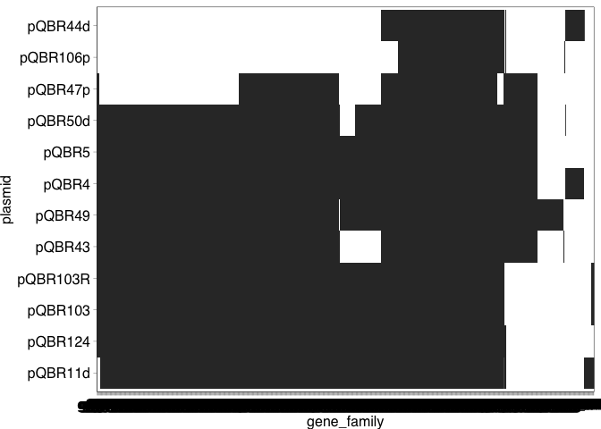<!-- -->

Look at the broader family members too.

``` r
group_i_rel_pirate <- read.table("./2_pangenomes/a_group_i_rel_pirate_polished/PIRATE.gene_families.ordered.tsv",
                                 header=TRUE, sep="\t")

giprel_matrix <- data.frame(cbind(group_i_rel_pirate[2], ifelse(group_i_rel_pirate[23:length(group_i_rel_pirate)]=="", 0, 1))) %>%
  column_to_rownames("gene_family")

giprel_genefam_dendro <- hclust(dist(giprel_matrix))  
giprel_plasmid_dendro <- hclust(dist(t(giprel_matrix)))

giprel_genefam_order <- rownames(giprel_matrix)[giprel_genefam_dendro$order]
giprel_plasmid_order <- colnames(giprel_matrix)[giprel_plasmid_dendro$order]

giprel_long <- group_i_rel_pirate %>% select(gene_family, threshold, starts_with("pQ")) %>%
  pivot_longer(cols = starts_with("pQ"), names_to = "plasmid", values_to = "gene") %>% 
  filter(gene != "") %>%
  mutate(gene_family = factor(gene_family, levels=rev(giprel_genefam_order)),
         plasmid = factor(plasmid, levels=giprel_plasmid_order))

ggplot(giprel_long, aes(x=gene_family, y=plasmid)) + geom_tile()
```

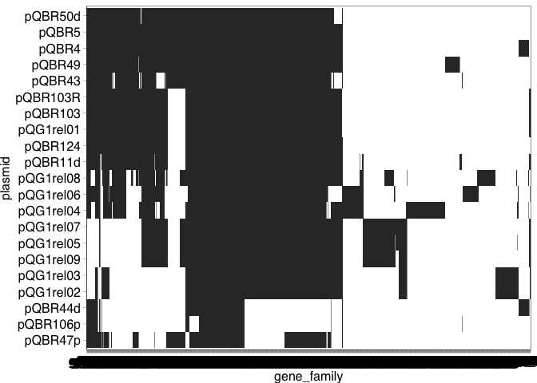<!-- -->

Calculate distances within each group (raw p-distance), and aggregate.

``` bash
find ./2_pangenomes/a_group_i_pirate_polished/feature_sequences -name "*.nucleotide.fasta" \
  | awk -v FS="/" '{print $5}' | sed 's/\.nu.*//g' | while read GROUP
  do
  megacc -a ./ref/distance_estimation_overall_mean_nucleotide_p.mao \
    -d ./2_pangenomes/a_group_i_pirate_polished/feature_sequences/${GROUP}.nucleotide.fasta \
    -o ./2_pangenomes/a_group_i_distances/${GROUP}
  done
  
find ./2_pangenomes/a_group_i_distances -name "*.csv" \
  | awk -v FS="/" '{print $4}' | sed 's/\..*//g' \
  | while read GROUP
  do
  dist=`tail -n +3 ./2_pangenomes/a_group_i_distances/${GROUP}.csv`
  echo $GROUP $dist
  done > ./2_pangenomes/a_group_i_distances.txt
```

Pull out interesting information about these groups.

``` r
a_group_i_distances <- read.table("./2_pangenomes/a_group_i_distances.txt",
                                  header = FALSE, col.names=c("gene_family","dist"), sep=" ")

group_i_pirate %>% left_join(a_group_i_distances, by="gene_family") %>%
  filter(dist>0) %>%
  arrange(-dist) %>% 
  select(gene_family, dist, consensus_product, threshold) %>% 
  head(n = 10) %>% kable()
```

| gene_family | dist | consensus_product | threshold |
|:---|---:|:---|---:|
| g0194 | 0.1496599 | Inner membrane protein | 70 |
| g0196 | 0.1379928 | Intracellular multiplication protein IcmV | 60 |
| g0207 | 0.1163522 | hypothetical protein | 60 |
| g0193 | 0.0920635 | tRNA-edit domain-containing protein | 70 |
| g0203 | 0.0586854 | Ald-Xan-dh-C2 domain-containing protein | 90 |
| g0159 | 0.0555556 | Lipoprotein | 60 |
| g0166 | 0.0534736 | Putative transmembrane protein | 60 |
| g0132 | 0.0530789 | PAPS-reduct domain-containing protein | 90 |
| g0192 | 0.0530303 | Znf/thioredoxin-put domain-containing protein | 80 |
| g0125 | 0.0526887 | Putative DNA-binding protein | 50 |

**NOTE** the locus tags outputted by PIRATE are different to those in
the Bakta annotations! Details are provided in the `modified_gffs`
folder in the PIRATE output.

#### Generate and visualise pangenome graph in Bandage

[Bandage](https://rrwick.github.io/Bandage/) can be used to visualise
the graph produced by PIRATE.

<figure>
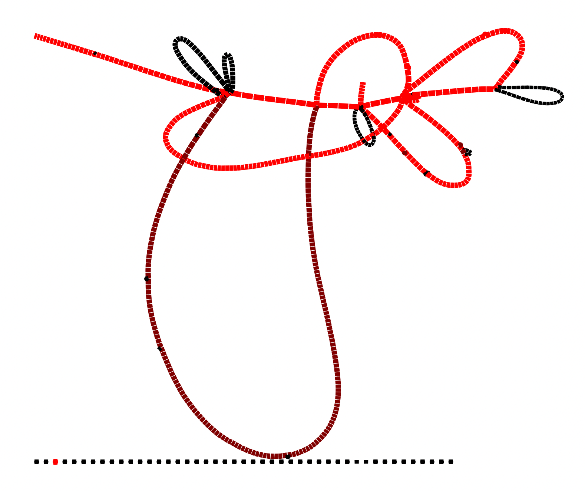
<figcaption
aria-hidden="true">group_i_pangenome_bandage.png</figcaption>
</figure>

The graph is coloured by depth, i.e. the brighter red regions are genes
that are found in more sequences. The genes at the bottom are found in
multiple locations within sequences, so their position in the graph
cannot be cleanly resolved.

This figure can be made more informative, by:

1.  Connecting the ends of the plasmid, so it is circular
2.  Changing the width of the nodes to correspond with depth
3.  Changing the colour of the nodes to correspond with within-group
    nucleotide diversity (p-distance).

Part 1 can be achieved by identifying the groups corresponding with the
start and the end of the plasmid, and adding a link in the
`pangenome.gfa` file.

Use pQBR103 as the canonical plasmid for setting this link. The first
gene is pQBR103_0005, which was renamed to pQBR103_0001 in the PIRATE
output. The last gene is:

``` bash
tail -n1 ./2_/pQBR103.tsv

grep "pQBR103_02750" ./2_pangenomes/a_group_i_pirate_polished/modified_gffs/pQBR103.gff
```

pQBR103_00550 (in the PIRATE output). The corresponding groups for these
genes are:

``` r
group_i_pirate %>% filter(pQBR103 %in% c("pQBR103_00001","pQBR103_00550")) %>% 
  select(gene_family)
```

    ##   gene_family
    ## 1       g0035
    ## 2       g0092

Gene families g0035 and g0092. Add a link to the `pangenome.gfa` file.

``` bash
cp ./2_pangenomes/a_group_i_pirate_polished/pangenome.gfa \
  ./2_pangenomes/a_group_i_pirate_polished_pangenome.gfa
  
echo -e 'L\tg0035\t+\tg0092\t+\t0M' >> ./2_pangenomes/a_group_i_pirate_polished_pangenome.gfa
```

Part 2 is defined within Bandage preferences, by setting ‘Depth effect
on width’ to 90% and ‘Depth effect power’ to 0.9.

Part 3 is defined by adding in a label `.csv` file. How should the
distances be scaled with colour?

``` r
a_group_i_distances %>% ggplot(aes(x = dist)) + geom_density()
```

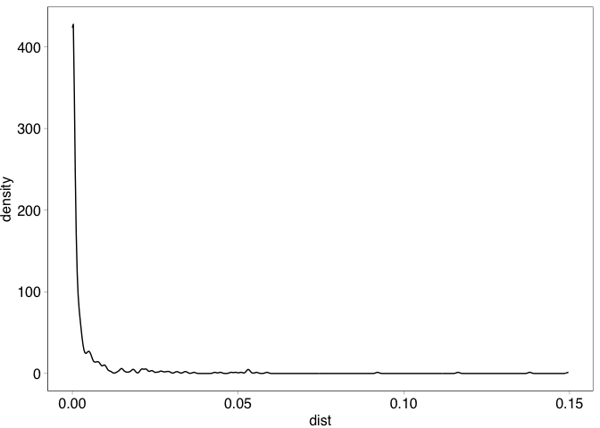<!-- -->

``` r
a_group_i_distances %>% ggplot(aes(x = log10(dist))) + geom_density()
```

    ## Warning: Removed 213 rows containing non-finite outside the scale range
    ## (`stat_density()`).

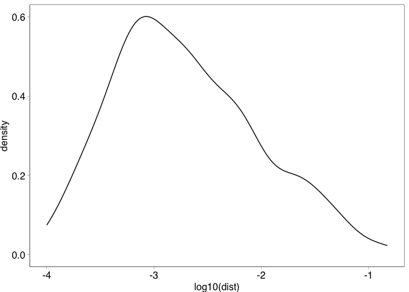<!-- -->

``` r
a_group_i_distances %>% 
  summarise(min = min(dist),
            mean = mean(dist),
            median = median(dist),
            max = max(dist)) %>% kable()
```

| min |      mean |    median |       max |
|----:|----------:|----------:|----------:|
|   0 | 0.0044543 | 0.0005291 | 0.1496599 |

Shows that in most cases, there is 0-0.1% distance within a group, with
a long tail up to ~14% distance within a group.

Use a gradient of black to blue between 0 and 0.1%, and blue to yellow
from 0.1% to 15%, and output as a `.csv`. Generate the palette using
`scales`.

``` r
pal <- scales::gradient_n_pal(colours = c("black","dodgerblue","goldenrod","goldenrod1"),
                              values= c(0, 0.001, 0.05, 0.15))
a_group_i_distances$hex_from_scales <- pal(a_group_i_distances$dist)

a_group_i_distances %>% 
  full_join(select(group_i_pirate, gene_family, consensus_product),
            by="gene_family") %>%
  mutate(Name = gene_family, 
         Product = consensus_product,
         Colour = ifelse(is.na(hex_from_scales), "#4d4d4d", hex_from_scales)) %>%
  select(Name, Product, Colour) %>% 
  write.table(file = "./2_pangenomes/a_group_i_pirate_polished_pangenome_cols.csv",
              sep=",", quote=FALSE, row.names=FALSE)
```

<figure>
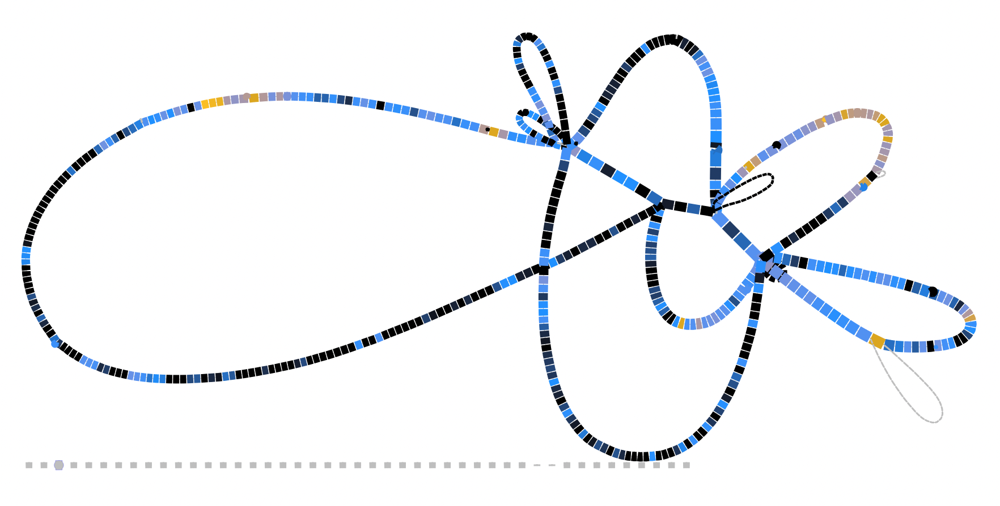
<figcaption aria-hidden="true">Group I bandage plot with
distances</figcaption>
</figure>

Note that some gene groups don’t have distance calculations. For
example, the transposon on the right is represented in only one plasmid,
so distances couldn’t be calculated. The separate contigs at the bottom
couldn’t be resolved at a single location in the graph, as they were
present in multiple locations on one or more sequences.

This information can also be presented on the heatmap above.

``` r
gip_long %>% 
  left_join(a_group_i_distances, by="gene_family") %>%
  mutate(distcol = ifelse(is.na(hex_from_scales), "#4d4d4d", hex_from_scales),
         gene_family = factor(gene_family, levels=rev(gip_genefam_order)),
         plasmid = factor(plasmid, levels=gip_plasmid_order)) %>%
  ggplot(aes(x=gene_family, y=plasmid)) + 
  geom_tile(aes(fill=distcol)) +
  scale_fill_identity()
```

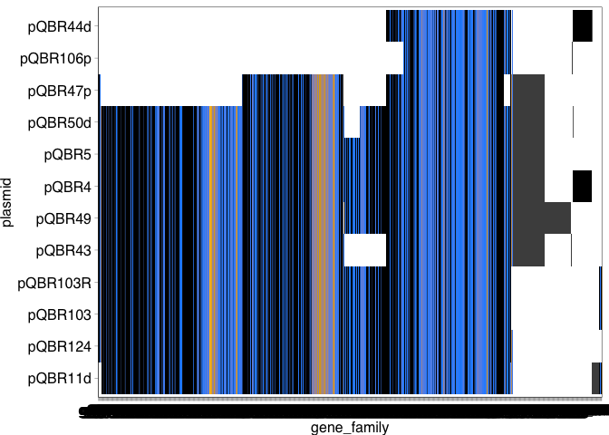<!-- -->

This figure shows the single transposon in grey that was uncoloured in
the graph above, and (presumably) another transposon that is present in
multiple copies in pQBR47, pQBR50, pQBR5, pQBR4, pQBR49 and pQBR43.

Reorder this by the distances within each cluster. Requires to order the
heatmap by clusters, rather than following directly the order on the
dendrogram.

``` r
gip_gene_clusters <- cutree(gip_genefam_dendro, h = 0)

gip_gene_clusters_df <- data.frame(
  gene_family = names(gip_gene_clusters),
  cluster = gip_gene_clusters) %>% 
  left_join(a_group_i_distances, by="gene_family")

gip_clusters <- gip_gene_clusters_df[order(gip_gene_clusters_df$cluster,
                                           gip_gene_clusters_df$dist),]

gip_long %>% 
  left_join(a_group_i_distances, by="gene_family") %>%
  mutate(distcol = ifelse(is.na(hex_from_scales), "#4d4d4d", hex_from_scales),
         gene_family = factor(gene_family, levels=gip_clusters$gene_family),
         plasmid = factor(plasmid, levels=gip_plasmid_order)) %>%
  ggplot(aes(x=gene_family, y=plasmid)) + 
  geom_tile(aes(fill=distcol)) +
  scale_fill_identity()
```

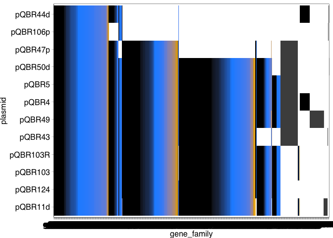<!-- -->

#### Re-make the pangenomes to include the duplicated transposons

``` bash
script_path=/pub60/jamesh/miniforge3/envs/pirate_env/scripts
pirate_dir=a_group_i_pirate_polished

perl $script_path/pangenome_graph.pl\
  -i $pirate_dir/PIRATE.gene_families.tsv \
  -gff $pirate_dir/modified_gffs/ \
  -o a_group_i_pirate_polished_all --gfa
```

This made the graph much more complex and difficult to interpret, so the
previous graph is preferred.

<figure>
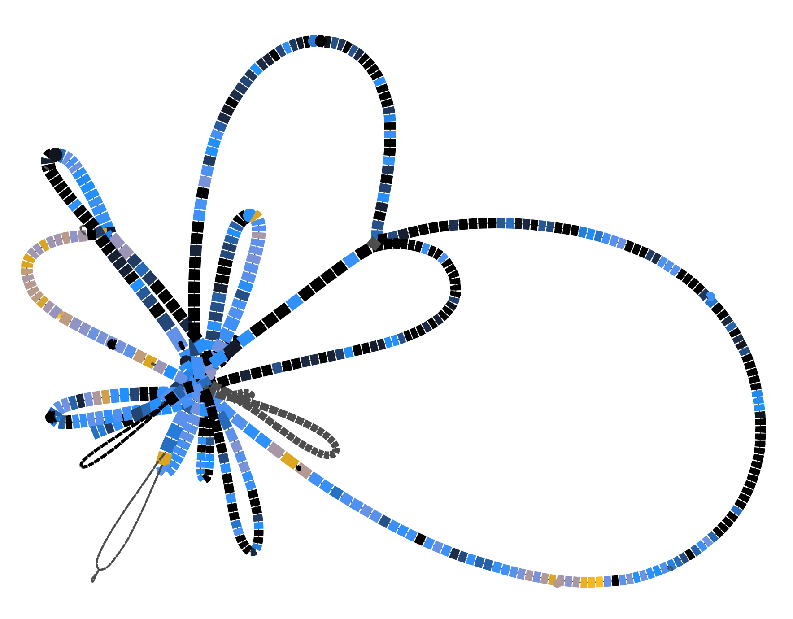
<figcaption aria-hidden="true">Group I bandage plot with distances (all
groups)</figcaption>
</figure>

Next steps:

- Probably will want to remove pQBR103R from the analysis
- Complete pangenome graph analysis for the pQBR103 relatives
- Complete analyses for other plasmid groups

### Group IV plasmids (pQBR57-like)

#### Identify similar plasmids from databases using MASH

Create a backbone sequence for pQBR57. Tn5042 goes from 103738..110729
in the reoriented sequence.

``` bash
seqret -sequence ./bakta_a/pQBR57/pQBR57.fna \
  -sformat1 fasta \
  -osformat2 fasta \
  -sbegin 1 \
  -send1 103738 \
  -outseq tmp1.fasta
seqret -sequence ./bakta_a/pQBR57/pQBR57.fna \
  -sformat1 fasta \
  -osformat2 fasta \
  -sbegin 110729 \
  -send1 307330 \
  -outseq tmp2.fasta
cat tmp1.fasta tmp2.fasta \
  | union -filter -osname2 pQBR57_backbone \
  > ./MASH_sketches/pQBR57_backbone.fasta
  
rm tmp*.fasta
```

Sketch sequence and run against databases. Include also the
[RefSeq88](https://mash.readthedocs.io/en/latest/data.html) database
provided by mash.

``` bash
mash sketch -s 10000 ./MASH_sketches/pQBR57_backbone.fasta \
  -o ./MASH_sketches/pQBR57_backbone.msh
  
mash dist -p 64 \
  ./MASH_sketches/pQBR57_backbone.msh \
  ../MASH_DBS/refseq.genomes+plasmid.k21s1000.msh \
  > ./MASH_sketches/pQBR57b_refseq_mash_results.txt

mash dist -p 64 \
  ./MASH_sketches/pQBR57_backbone.msh \
  ../MASH_DBS/pseudomonas_complete.fasta.msh \
  > ./MASH_sketches/pQBR57b_ps_comp_mash_results.txt
  
mash dist -p 64 \
  ./MASH_sketches/pQBR57_backbone.msh \
  ../MASH_DBS/pseudomonas_draft.fasta.msh \
  > ./MASH_sketches/pQBR57b_ps_draft_mash_results.txt  
  
mash dist -p 64 \
  ./MASH_sketches/pQBR57_backbone.msh \
  ../MASH_DBS/plsdb.fasta.msh \
  > ./MASH_sketches/pQBR57b_plsdb_mash_results.txt  
```

Pull out sequences and aggregate. Extract sequences with e-value \<
1e-100 and pairwise BLAST, to identify a minimum level of horizontal
coverage.

``` bash
awk '$4 < 1e-100 {print $2}' ./2_sketches/pQBR57b_ps_draft_mash_results.txt \
  | sed 's/_[0-9]*//g' | sort | uniq | while read CODE
  do
  grep "^$CODE" ./2_sketches/draft_keylist_pseudomonas.csv \
    | awk -v FS="," '{print $2}' | sort | uniq | while read GENOME
    do
    grep "$GENOME" ./ref/strain_summary.txt \
      >> ./2_relatives/matches/pQBR57b_ps_draft_matches.txt
  done
  done
  
awk '$4 < 1e-100 {print $2}' ./2_sketches/pQBR57b_ps_comp_mash_results.txt \
  | sed 's/_[0-9]*//g' | sort | uniq | while read CODE
  do
  grep "^$CODE" ./2_sketches/complete_keylist_pseudomonas.csv \
    | awk -v FS="," '{print $2}' | sort | uniq | while read GENOME
    do
    grep "$GENOME" ./ref/strain_summary.txt \
      >> ./2_relatives/matches/pQBR57b_ps_comp_matches.txt
  done
  done
```

Only the draft PseudomonasDB database had matches that met these
criteria for pQBR57-like plasmids. PLSDB only matched to the existing
pQBR57 (LN713926).

``` bash
mkdir ./2_relatives/pQBR57_seqs/

awk -v FS="\t" '{print $24, $25}' ./2_relatives/matches/pQBR57b_ps_draft_matches.txt | while read DIR FILE
do 
wget ${DIR}/${FILE} -O ./2_relatives/pQBR57_seqs/${FILE}
done
```

Blast against these sequences.

``` bash
find ./2_relatives/pQBR57_seqs/ -name "*.fna.gz" -exec gunzip {} \;

cat ./2_relatives/pQBR57_seqs/*.fna | sed 's/|/_/g' | sed 's/>refseq_/>/g' \
  > ./2_relatives/pQBR57_relatives.fasta

makeblastdb -dbtype nucl -in ./2_relatives/pQBR57_relatives.fasta \
  -out ./2_relatives/blastdb/pQBR57_relatives

blastn -query ./2_sketches/pQBR57_backbone.fasta -db ./2_relatives/blastdb/pQBR57_relatives -outfmt 6 \
  > ./2_relatives/pQBR57_relatives.blastn
```

Extract, reorient, and Bakta the sequences. Extract sequences with \>5
kb match and an e-value \< 1e-40

``` bash
awk -v FS="\t" '$11 < 1e-40 && $4 > 5000 {print $2}' "./2_relatives/pQBR57_relatives.blastn" \
 | sort | uniq > ./2_relatives/pQBR57_relatives.list
```

There is only one single-contig sequence here: NZ_JANHLM010000005.1.

#### Reorient and annotate pQBR57-like plasmid

``` bash
awk -v RS=">" '$1 ~ /NZ_JANHLM010000005.1/ {print RS $0}' ./2_relatives/pQBR57_relatives.fasta \
  | sed 's/>.*/>pQG4rel01/g' \
  > ./2_relatives/pQBR57_seqs_plasmids/pQG4rel01.fa

blastn -query ./2_relatives/pQBR57_seqs_plasmids/pQG4rel01.fa -db ./ref/rep.fasta -outfmt 6 \
  >  ./2_relatives/pQBR57_relatives_complete_blast_rep.blastn
```

Use this output to realign the sequences using EMBOSS.

``` bash
mkdir ./2_relatives/pQBR57_seqs_plasmid_orient

cat ./2_relatives/pQBR57_relatives_complete_blast_rep.blastn | while read SEQ MATCH PERC LEN GAP MM QSTART QFIN SSTART SFIN EVAL BITSC
do
let endposf=$QSTART-1
let endposr=$QFIN+1
if [ $SFIN -lt $SSTART ]
then
echo "$SEQ is in reverse direction"
seqret -sformat1 fasta \
  -osformat2 fasta \
  -sbegin 1 \
  -send ${QFIN} \
  -srev \
  -sequence ./2_relatives/pQBR57_seqs_plasmids/${SEQ}.fa \
  -filter > tmp1.fasta
seqret -sformat1 fasta \
  -osformat2 fasta \
  -srev \
  -sbegin1 $endposr \
  -sequence ./2_relatives/pQBR57_seqs_plasmids/${SEQ}.fa \
  -filter > tmp2.fasta
cat tmp1.fasta tmp2.fasta \
  | union -filter -osname2 $SEQ \
  > ./2_relatives/pQBR57_seqs_plasmid_orient/${SEQ}_o.fasta  
else
echo "$SEQ is in forward direction"
seqret -sequence ./2_relatives/pQBR57_seqs_plasmids/${SEQ}.fa \
  -sformat1 fasta \
  -osformat2 fasta \
  -sbegin ${QSTART} \
  -outseq tmp1.fasta
seqret -sequence ./2_relatives/pQBR57_seqs_plasmids/${SEQ}.fa \
  -sformat1 fasta \
  -osformat2 fasta \
  -sbegin 1 \
  -send1 $endposf \
  -outseq tmp2.fasta
cat tmp1.fasta tmp2.fasta \
  | union -filter -osname2 $SEQ \
  > ./2_relatives/pQBR57_seqs_plasmid_orient/${SEQ}_o.fasta  
fi
done
```

Remove duplicated sequences manually, and annotate.

``` bash
bakta --db /pub60/jamesh/db --prefix pQG4rel01 \
  --complete \
  --locus pQG4rel01_contig \
  --verbose \
  --output ./bakta/pQG4rel01 \
  --plasmid pQG4rel01 \
  --threads 128 \
  --locus-tag pQG4rel01 \
  --meta \
  pQG4rel01_o.fasta
```

#### Analyse pangenomes of pQBR57-like plasmids

Run [PIRATE](https://github.com/SionBayliss/PIRATE) ([Bayliss et
al. 2019](https://doi.org/10.1093/gigascience/giz119)).

``` bash
mkdir ./a_group_iv_gff
cp ./bakta_a/pQBR57/pQBR57.gff3 ./a_group_iv_gff/pQBR57.gff
cp ./bakta_a/pQBR56/pQBR56.gff3 ./a_group_iv_gff/pQBR56.gff
cp ./bakta_a/pQBR51/pQBR51.gff3  ./a_group_iv_gff/pQBR51.gff
cp ./bakta_a/pQBR30/pQBR30.gff3  ./a_group_iv_gff/pQBR30.gff
cp ./bakta_a/pQBR102/pQBR102.gff3    ./a_group_iv_gff/pQBR102.gff
cp ./bakta_a/pQBR150/pQBR150.gff3   ./a_group_iv_gff/pQBR150.gff

PIRATE -i ./a_group_iv_gff -o ./a_group_iv_pirate_polished -a
```

And run PIRATE again, with the additional relative.

``` bash
mkdir ./a_group_iv_rel_gff

cp ./group_iv_relatives/2_relatives/bakta/pQG4rel01/pQG4rel01.gff3 \
  ./a_group_iv_rel_gff/pQG4rel01.gff
  
cp ./a_group_iv_gff/*.gff ./a_group_iv_rel_gff

PIRATE -i ./a_group_iv_rel_gff -o ./a_group_iv_rel_pirate_polished -a
```

First, investigate just the pQBR plasmids.

Open data, cluster according to grouping patterns, and make a rough
plot.

``` r
group_iv_pirate <- read.table("./2_pangenomes/a_group_iv_pirate_polished/PIRATE.gene_families.ordered.tsv", 
                             header=TRUE, sep="\t")

givp_matrix <- data.frame(cbind(group_iv_pirate[2], ifelse(group_iv_pirate[23:length(group_iv_pirate)]=="", 0, 1))) %>%
  column_to_rownames("gene_family")

givp_genefam_dendro <- hclust(dist(givp_matrix))  
givp_plasmid_dendro <- hclust(dist(t(givp_matrix)))

givp_genefam_order <- rownames(givp_matrix)[givp_genefam_dendro$order]
givp_plasmid_order <- colnames(givp_matrix)[givp_plasmid_dendro$order]

givp_long <- group_iv_pirate %>% select(gene_family, threshold, starts_with("pQBR")) %>%
  pivot_longer(cols = starts_with("pQBR"), names_to = "plasmid", values_to = "gene") %>% 
  filter(gene != "") %>%
  mutate(gene_family = factor(gene_family, levels=rev(givp_genefam_order)),
         plasmid = factor(plasmid, levels=givp_plasmid_order))

ggplot(givp_long, aes(x=gene_family, y=plasmid)) + geom_tile()
```

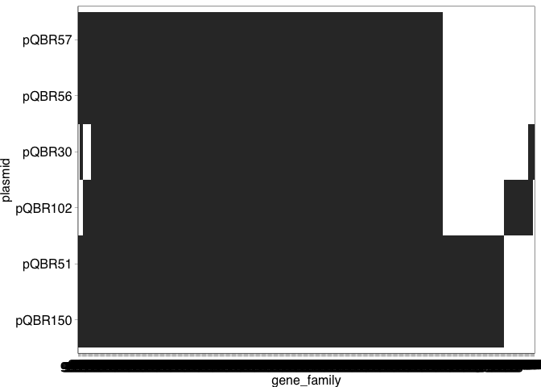<!-- -->

More straightforward than pQBR103-like plasmids.

Look at the broader family members too.

``` r
group_iv_rel_pirate <- read.table("./2_pangenomes/a_group_iv_rel_pirate_polished/PIRATE.gene_families.ordered.tsv",
                                 header=TRUE, sep="\t")

givprel_matrix <- data.frame(cbind(group_iv_rel_pirate[2], ifelse(group_iv_rel_pirate[23:length(group_iv_rel_pirate)]=="", 0, 1))) %>%
  column_to_rownames("gene_family")

givprel_genefam_dendro <- hclust(dist(givprel_matrix))  
givprel_plasmid_dendro <- hclust(dist(t(givprel_matrix)))

givprel_genefam_order <- rownames(givprel_matrix)[givprel_genefam_dendro$order]
givprel_plasmid_order <- colnames(givprel_matrix)[givprel_plasmid_dendro$order]

givprel_long <- group_iv_rel_pirate %>% select(gene_family, threshold, starts_with("pQ")) %>%
  pivot_longer(cols = starts_with("pQ"), names_to = "plasmid", values_to = "gene") %>% 
  filter(gene != "") %>%
  mutate(gene_family = factor(gene_family, levels=rev(givprel_genefam_order)),
         plasmid = factor(plasmid, levels=givprel_plasmid_order))

ggplot(givprel_long, aes(x=gene_family, y=plasmid)) + geom_tile()
```

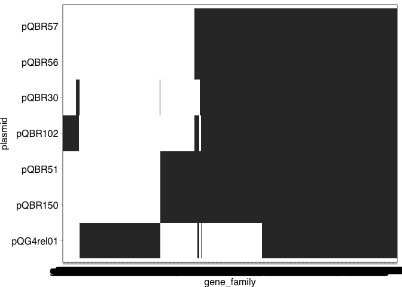<!-- -->

The relative lacks a chunk present in all other Group IV plasmids, and
contains a different segment.

Calculate distances within each group (raw p-distance), and aggregate.

``` bash
find ./2_pangenomes/a_group_iv_pirate_polished/feature_sequences -name "*.nucleotide.fasta" \
  | awk -v FS="/" '{print $5}' | sed 's/\.nu.*//g' | while read GROUP
  do
  megacc -a ./ref/distance_estimation_overall_mean_nucleotide_p.mao \
    -d ./2_pangenomes/a_group_iv_pirate_polished/feature_sequences/${GROUP}.nucleotide.fasta \
    -o ./2_pangenomes/a_group_iv_distances/${GROUP}
  done
  
find ./2_pangenomes/a_group_iv_distances -name "*.csv" \
  | awk -v FS="/" '{print $4}' | sed 's/\..*//g' \
  | while read GROUP
  do
  dist=`tail -n +3 ./2_pangenomes/a_group_iv_distances/${GROUP}.csv`
  echo $GROUP $dist
  done > ./2_pangenomes/a_group_iv_distances.txt
```

Pull out interesting information about these groups.

``` r
a_group_iv_distances <- read.table("./2_pangenomes/a_group_iv_distances.txt",
                                  header = FALSE, col.names=c("gene_family","dist"), sep=" ")

group_iv_pirate %>% left_join(a_group_iv_distances, by="gene_family") %>%
  filter(dist>0) %>%
  arrange(-dist) %>% 
  select(gene_family, dist, consensus_product, threshold) %>% 
  head(n = 10) %>% kable()
```

| gene_family | dist | consensus_product | threshold |
|:---|---:|:---|---:|
| g0359 | 0.1030928 | Transcriptional regulator | 70 |
| g0351 | 0.1030386 | Serine/threonine protein kinase | 70 |
| g0358 | 0.0996564 | Bacteriophage protein | 70 |
| g0342 | 0.0987467 | YrdC-like domain-containing protein | 70 |
| g0354 | 0.0863492 | Leader peptidase (Prepilin peptidase) | 70 |
| g0352 | 0.0786764 | hypothetical protein | 80 |
| g0361 | 0.0612346 | Leader peptidase (Prepilin peptidase) | 80 |
| g0343 | 0.0599156 | Cytosine/purine/uracil/thiamine/allantoin permease family protein | 80 |
| g0341 | 0.0591794 | Ferredoxin | 80 |
| g0350 | 0.0563826 | DNA replication terminus site-binding protein | 90 |

#### Generate and visualise pangenome graph in Bandage

Follow the example above to draw a pangenome graph for Group IV
plasmids.

Set the link circularising the plasmid, using pQBR57. The first gene is
pQBR57_00001, the last gene is:

``` bash
tail -n1 ./bakta_annotated/pQBR57/pQBR57.tsv

grep "PQBR57_01975" ./2_pangenomes/a_group_iv_pirate_polished/modified_gffs/pQBR57.gff
```

pQBR57_00395 (in the PIRATE output). The corresponding groups for these
genes are:

``` r
group_iv_pirate %>% filter(pQBR57 %in% c("pQBR57_00001","pQBR57_00395")) %>% 
  select(gene_family)
```

    ##   gene_family
    ## 1       g0037
    ## 2       g0200

Gene families g0037 and g0200. Add a link to the `pangenome.gfa` file.

``` bash
cp ./2_pangenomes/a_group_iv_pirate_polished/pangenome.gfa \
  ./2_pangenomes/a_group_iv_pirate_polished_pangenome.gfa
  
echo -e 'L\tg0037\t+\tg0200\t+\t0M' >> ./2_pangenomes/a_group_iv_pirate_polished_pangenome.gfa
```

Adding a label `.csv` file, as above.

``` r
a_group_iv_distances %>% ggplot(aes(x = dist)) + geom_density()
```

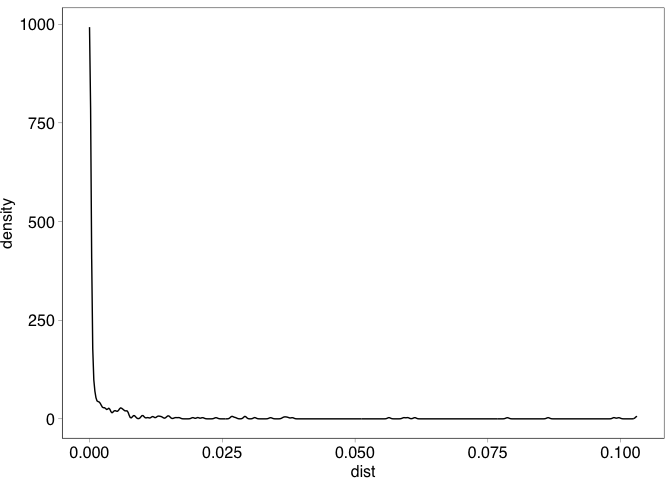<!-- -->

``` r
a_group_iv_distances %>% ggplot(aes(x = log10(dist))) + geom_density()
```

    ## Warning: Removed 298 rows containing non-finite outside the scale range
    ## (`stat_density()`).

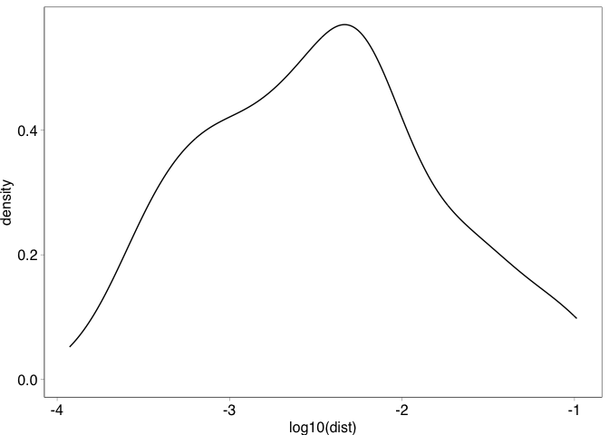<!-- -->

``` r
a_group_iv_distances %>% 
  summarise(min = min(dist),
            mean = mean(dist),
            median = median(dist),
            max = max(dist)) %>% kable()
```

| min |      mean | median |       max |
|----:|----------:|-------:|----------:|
|   0 | 0.0038619 |      0 | 0.1030928 |

Shows that in most cases, there is 0-0.1% distance within a group, with
a long tail up to ~11% distance within a group.

Use the same gradient as above.

``` r
a_group_iv_distances$hex_from_scales <- pal(a_group_iv_distances$dist)

a_group_iv_distances %>% 
  full_join(select(group_iv_pirate, gene_family, consensus_product),
            by="gene_family") %>%
  mutate(Name = gene_family, 
         Product = consensus_product,
         Colour = ifelse(is.na(hex_from_scales), "#4d4d4d", hex_from_scales)) %>%
  select(Name, Product, Colour) %>% 
  write.table(file = "./2_pangenomes/a_group_iv_pirate_polished_pangenome_cols.csv",
              sep=",", quote=FALSE, row.names=FALSE)
```

<figure>
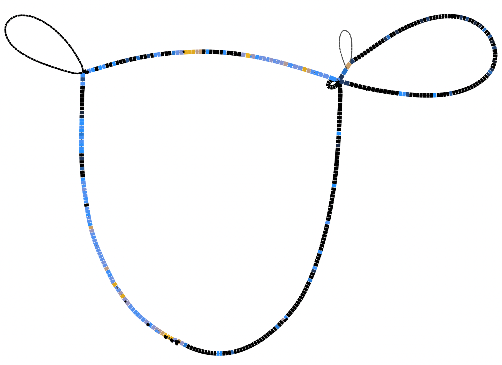
<figcaption aria-hidden="true">Group IV bandage plot with
distances</figcaption>
</figure>

This information can also be presented on the heatmap, again ordered by
distance.

Reorder this by the distances within each cluster. Requires to order the
heatmap by clusters, rather than following directly the order on the
dendrogram.

``` r
givp_gene_clusters <- cutree(givp_genefam_dendro, h = 0)

givp_gene_clusters_df <- data.frame(
  gene_family = names(givp_gene_clusters),
  cluster = givp_gene_clusters) %>% 
  left_join(a_group_iv_distances, by="gene_family")

givp_clusters <- givp_gene_clusters_df[order(givp_gene_clusters_df$cluster,
                                           givp_gene_clusters_df$dist),]

givp_long %>% 
  left_join(a_group_iv_distances, by="gene_family") %>%
  mutate(distcol = ifelse(is.na(hex_from_scales), "#4d4d4d", hex_from_scales),
         gene_family = factor(gene_family, levels=givp_clusters$gene_family),
         plasmid = factor(plasmid, levels=givp_plasmid_order)) %>%
  ggplot(aes(x=gene_family, y=plasmid)) + 
  geom_tile(aes(fill=distcol)) +
  scale_fill_identity()
```

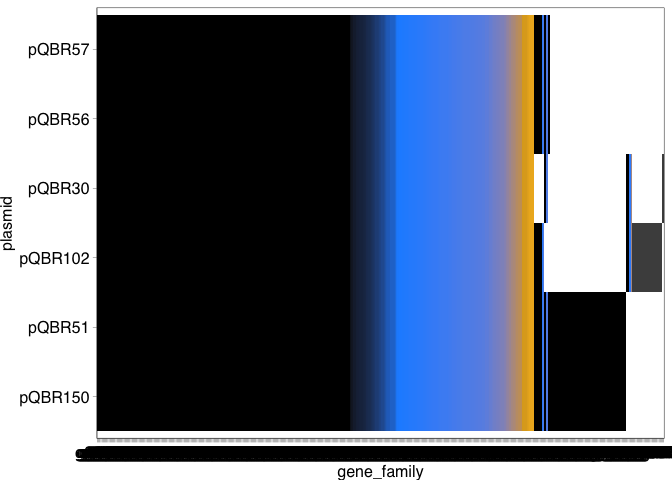<!-- -->

### Group III plasmids (pQBR55-like)

#### Identify similar plasmids from databases using MASH

Create a backbone sequence for pQBR55. Note that the resequenced pQBR55
(pQBR55R) lacks the Tn4652, and so is a better candidate for this
reference.

Tn5042 goes from 110044..117035 in the reoriented sequence.

``` bash
seqret -sequence ./bakta_a/pQBR55R/pQBR55R.fna \
  -sformat1 fasta \
  -osformat2 fasta \
  -sbegin 1 \
  -send1 110044 \
  -outseq tmp1.fasta
seqret -sequence ./bakta_a/pQBR55R/pQBR55R.fna \
  -sformat1 fasta \
  -osformat2 fasta \
  -sbegin 117035 \
  -send1 140432 \
  -outseq tmp2.fasta
cat tmp1.fasta tmp2.fasta \
  | union -filter -osname2 pQBR55_backbone \
  > ./MASH_sketches/pQBR55_backbone.fasta
  
rm tmp*.fasta
```

Sketch sequence and run against databases. Include also the
[RefSeq88](https://mash.readthedocs.io/en/latest/data.html) database
provided by mash.

``` bash
mash sketch -s 10000 ./MASH_sketches/pQBR55_backbone.fasta \
  -o ./MASH_sketches/pQBR55_backbone.msh
  
mash dist -p 64 \
  ./MASH_sketches/pQBR55_backbone.msh \
  ../MASH_DBS/refseq.genomes+plasmid.k21s1000.msh \
  > ./MASH_sketches/pQBR55b_refseq_mash_results.txt

mash dist -p 64 \
  ./MASH_sketches/pQBR55_backbone.msh \
  ../MASH_DBS/pseudomonas_complete.fasta.msh \
  > ./MASH_sketches/pQBR55b_ps_comp_mash_results.txt
  
mash dist -p 64 \
  ./MASH_sketches/pQBR55_backbone.msh \
  ../MASH_DBS/pseudomonas_draft.fasta.msh \
  > ./MASH_sketches/pQBR55b_ps_draft_mash_results.txt  
  
mash dist -p 64 \
  ./MASH_sketches/pQBR55_backbone.msh \
  ../MASH_DBS/plsdb.fasta.msh \
  > ./MASH_sketches/pQBR55b_plsdb_mash_results.txt  
```

Pull out sequences and aggregate. Extract sequences with e-value \<
1e-100 and pairwise BLAST, to identify a minimum level of horizontal
coverage.

``` bash
awk '$4 < 1e-100 {print $2}' ./2_sketches/pQBR55b_ps_draft_mash_results.txt \
  | sed 's/_[0-9]*//g' | sort | uniq | while read CODE
  do
  grep "^$CODE" ./2_sketches/draft_keylist_pseudomonas.csv \
    | awk -v FS="," '{print $2}' | sort | uniq | while read GENOME
    do
    grep "$GENOME" ./ref/strain_summary.txt \
      >> ./2_relatives/matches/pQBR55b_ps_draft_matches.txt
  done
  done
  
awk '$4 < 1e-100 {print $2}' ./2_sketches/pQBR55b_ps_comp_mash_results.txt \
  | sed 's/_[0-9]*//g' | sort | uniq | while read CODE
  do
  grep "^$CODE" ./2_sketches/complete_keylist_pseudomonas.csv \
    | awk -v FS="," '{print $2}' | sort | uniq | while read GENOME
    do
    grep "$GENOME" ./ref/strain_summary.txt \
      >> ./2_relatives/matches/pQBR55b_ps_comp_matches.txt
  done
  done

awk -v FS="\t" '{print $24, $25}' ./2_relatives/matches/pQBR55b_ps_draft_matches.txt | while read DIR FILE
do 
wget ${DIR}/${FILE} -O ./2_relatives/pQBR55_seqs/${FILE}
done

awk -v FS="\t" '{print $24, $25}' ./2_relatives/matches/pQBR55b_ps_comp_matches.txt | while read DIR FILE
do 
wget ${DIR}/${FILE} -O ./2_relatives/pQBR55_seqs/${FILE}
done

awk '$4 < 1e-100 {print $2}' ./2_sketches/pQBR55b_plsdb_mash_results.txt | while read GB
do
curl "https://eutils.ncbi.nlm.nih.gov/entrez/eutils/efetch.fcgi?db=nucleotide&amp;id=${GB}&amp;rettype=fasta" |
  gzip > ./2_relatives/pQBR55_seqs/${GB}.fna.gz
done
```

Note: this is for PseudomonasDB and PLSDB, because all of the relevant
matching RefSeq entries were included as part of PseudomonasDB or PLSDB:

``` bash
awk '$4 < 1e-8 {print $2}' ./2_sketches/pQBR55b_refseq_mash_results.txt
```

- GCF_001297215.1_ASM129721v1_genomic.fna.gz - Pseudomonas sp. RIT-PI-o,
  in PseudomonasDB
- GCF_001401375.1_PalICMP15200_genomic.fna.gz - Pseudomonas syringae pv.
  alisalensis ICMP15200, in PseudomonasDB
- GCF_001728855.1_1D4v1.0_genomic.fna.gz - Pseudomonas sp. AP19, in
  PseudomonasDB
- ref\|NC_003892.2\| - the previous sequenced fragment of pQBR55
- ref\|NZ_CP006257.1\| - Pseudomonas syringae pv. syringae HS191, not in
  other databases
- ref\|NZ_CP017887.1\| - Pseudomonas frederiksbergensis strain ERDD5:01,
  in PLSDB

``` bash
curl "https://eutils.ncbi.nlm.nih.gov/entrez/eutils/efetch.fcgi?db=nucleotide&amp;id=NZ_CP006257.1&amp;rettype=fasta" \
  | gzip > ./2_relatives/pQBR55_seqs/NZ_CP006257.1.fna.gz
```

Blast against these sequences.

``` bash
find ./2_relatives/pQBR55_seqs/ -name "*.fna.gz" -exec gunzip {} \;

cat ./2_relatives/pQBR55_seqs/*.fna | sed 's/|/_/g' | sed 's/>refseq_/>/g' \
  > ./2_relatives/pQBR55_relatives.fasta

makeblastdb -dbtype nucl -in ./2_relatives/pQBR55_relatives.fasta \
  -out ./2_relatives/blastdb/pQBR55_relatives

blastn -query ./2_sketches/pQBR55_backbone.fasta -db ./2_relatives/blastdb/pQBR55_relatives -outfmt 6 \
  > ./2_relatives/pQBR55_relatives.blastn
```

Extract, reorient, and Bakta the sequences. Extract sequences with \>5
kb match and an e-value \< 1e-40

``` bash
awk -v FS="\t" '$11 < 1e-40 && $4 > 5000 {print $2}' ./2_relatives/pQBR55_relatives.blastn \
 | sort | uniq > ./2_relatives/pQBR55_relatives.list
```

Removed duplicates and saved in
`2_relatives/pQBR55_relatives_complete.list`

#### Reorient and annotate pQBR103-like plasmids

``` bash
seqtk subseq ./2_relatives/pQBR55_relatives.fasta ./2_relatives/pQBR55_relatives_complete.list \
  > ./2_relatives/pQBR55_relatives_complete.fasta

awk '/^>/ {OUT=substr($0,2) ".fa"}; {print >> OUT; close(OUT)}' ./2_relatives/pQBR55_relatives_complete.fasta

for file in *.fa; do
  new_name=$(echo "$file" | awk -F' ' '{print $1}')
  if [[ "$file" != "$new_name" ]]; then
    mv "$file" "./2_relatives/pQBR55_seqs_plasmids/${new_name}.fa"
  fi
done

find ./2_relatives/pQBR55_seqs_plasmids -name "*.fa" \
  -exec blastn -query {} -db ./ref/rep.fasta -outfmt 6 \; \
  >  ./2_relatives/pQBR55_relatives_complete_blast_rep.blastn
```

Use this output to realign the sequences using EMBOSS.

``` bash
cat ./2_relatives/pQBR55_relatives_complete_blast_rep.blastn | awk '$4 < 1524 {print $0}'
```

Interestingly, many of these replicases are shorter than the canonical
pQBR55 replicase. and NZ_CP017887.1 has two sequences that match. On
inspection the relevant one is the second entry, which is shorter and
appears to have a frameshift near the start. Can investigate this
separately. Manually removed the second entry.

``` bash
cp ./2_relatives/pQBR55_relatives_complete_blast_rep.blastn \
  ./2_relatives/pQBR55_relatives_complete_blast_rep_edit.blastn

mkdir ./2_relatives/pQBR55_seqs_plasmid_orient

cat ./2_relatives/pQBR55_relatives_complete_blast_rep_edit.blastn | while read SEQ MATCH PERC LEN GAP MM QSTART QFIN SSTART SFIN EVAL BITSC
do
let endposf=$QSTART-1
let endposr=$QFIN+1
if [ $SFIN -lt $SSTART ]
then
echo "$SEQ is in reverse direction"
seqret -sformat1 fasta \
  -osformat2 fasta \
  -sbegin 1 \
  -send ${QFIN} \
  -srev \
  -sequence ./2_relatives/pQBR55_seqs_plasmids/${SEQ}.fa \
  -filter > tmp1.fasta
seqret -sformat1 fasta \
  -osformat2 fasta \
  -srev \
  -sbegin1 $endposr \
  -sequence ./2_relatives/pQBR55_seqs_plasmids/${SEQ}.fa \
  -filter > tmp2.fasta
cat tmp1.fasta tmp2.fasta \
  | union -filter -osname2 $SEQ \
  > ./2_relatives/pQBR55_seqs_plasmid_orient/${SEQ}_o.fasta  
else
echo "$SEQ is in forward direction"
seqret -sequence ./2_relatives/pQBR55_seqs_plasmids/${SEQ}.fa \
  -sformat1 fasta \
  -osformat2 fasta \
  -sbegin ${QSTART} \
  -outseq tmp1.fasta
seqret -sequence ./2_relatives/pQBR55_seqs_plasmids/${SEQ}.fa \
  -sformat1 fasta \
  -osformat2 fasta \
  -sbegin 1 \
  -send1 $endposf \
  -outseq tmp2.fasta
cat tmp1.fasta tmp2.fasta \
  | union -filter -osname2 $SEQ \
  > ./2_relatives/pQBR55_seqs_plasmid_orient/${SEQ}_o.fasta  
fi
done
```

Annotate.

``` bash
counter=1
for file in ./pQBR55_seqs_plasmid_orient/*.fasta; do
  [ -f "$file" ] || continue
  padded_num=$(printf "%02d" "$counter")
  echo "$padded_num $file"
  ((counter++))
done > group_iii_relatives.list

cat group_iii_relatives.list |
while read NUM FILE
do
bakta --db /pub60/jamesh/db --prefix pQG3rel${NUM} \
  --complete \
  --locus pQG3rel${NUM}_contig \
  --verbose \
  --output ./bakta/pQG3rel${NUM} \
  --plasmid pQG3rel${NUM} \
  --threads 128 \
  --locus-tag pQG3rel${NUM} \
  --meta \
  $FILE
done
```

List the Group III relatives:

``` bash
cat ./2_relatives/group_iii_relatives.list
```

    ## 01 ./pQBR55_seqs_plasmid_orient/NZ_CP017887.1_plasmid_o.fasta
    ## 02 ./pQBR55_seqs_plasmid_orient/NZ_JAGLBM010000040.1_scaffold626_o.fasta
    ## 03 ./pQBR55_seqs_plasmid_orient/NZ_JALJWX010000002.1_contigGa0454254_02_o.fasta
    ## 04 ./pQBR55_seqs_plasmid_orient/NZ_JAQFHY010000002.1_Ga0417195_02_o.fasta
    ## 05 ./pQBR55_seqs_plasmid_orient/NZ_LHPA01000022.1_contig_15_o.fasta
    ## 06 ./pQBR55_seqs_plasmid_orient/NZ_QTTH01000012.1_._o.fasta

#### Analyse pangenomes of pQBR55-like plasmids

Run [PIRATE](https://github.com/SionBayliss/PIRATE) ([Bayliss et
al. 2019](https://doi.org/10.1093/gigascience/giz119)).

``` bash
mkdir ./a_group_iii_gff
cp ./bakta_a/pQBR55/pQBR55.gff3 ./a_group_iii_gff/pQBR55.gff
cp ./bakta_a/pQBR55R/pQBR55R.gff3 ./a_group_iii_gff/pQBR55R.gff
cp ./bakta_a/pQBR53/pQBR53.gff3  ./a_group_iii_gff/pQBR53.gff
cp ./bakta_a/pQBR28/pQBR28.gff3  ./a_group_iii_gff/pQBR28.gff
cp ./bakta_a/pQBR132/pQBR132.gff3    ./a_group_iii_gff/pQBR132.gff
cp ./bakta_a/pQBR127/pQBR127.gff3   ./a_group_iii_gff/pQBR127.gff

PIRATE -i ./a_group_iii_gff -o ./a_group_iii_pirate_polished -a
```

And run PIRATE again, with the additional relatives.

``` bash
mkdir ./a_group_iii_rel_gff

cp ./group_iii_relatives/2_relatives/bakta/*/*.gff3 ./a_group_iii_rel_gff
for file in ./a_group_iii_rel_gff/*.gff3; do name=`echo $file | sed 's/gff3/gff/g'`; mv $file $name; done
cp ./a_group_iii_gff/*.gff ./a_group_iii_rel_gff

PIRATE -i ./a_group_iii_rel_gff -o ./a_group_iii_rel_pirate_polished -a
```

First, investigate just the pQBR plasmids.

Open data, cluster according to grouping patterns, and make a rough
plot.

``` r
group_iii_pirate <- read.table("./2_pangenomes/a_group_iii_pirate_polished/PIRATE.gene_families.ordered.tsv", 
                             header=TRUE, sep="\t")

giiip_matrix <- data.frame(cbind(group_iii_pirate[2], ifelse(group_iii_pirate[23:length(group_iii_pirate)]=="", 0, 1))) %>%
  column_to_rownames("gene_family")

giiip_genefam_dendro <- hclust(dist(giiip_matrix))  
giiip_plasmid_dendro <- hclust(dist(t(giiip_matrix)))

giiip_genefam_order <- rownames(giiip_matrix)[giiip_genefam_dendro$order]
giiip_plasmid_order <- colnames(giiip_matrix)[giiip_plasmid_dendro$order]

giiip_long <- group_iii_pirate %>% select(gene_family, threshold, starts_with("pQBR")) %>%
  pivot_longer(cols = starts_with("pQBR"), names_to = "plasmid", values_to = "gene") %>% 
  filter(gene != "") %>%
  mutate(gene_family = factor(gene_family, levels=rev(giiip_genefam_order)),
         plasmid = factor(plasmid, levels=giiip_plasmid_order))

ggplot(giiip_long, aes(x=gene_family, y=plasmid)) + geom_tile()
```

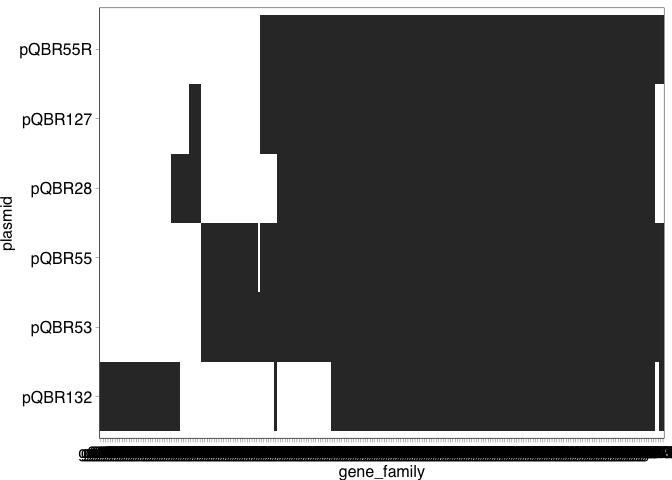<!-- -->

Also more straightforward than pQBR103-like plasmids.

Look at the broader family members too.

``` r
group_iii_rel_pirate <- read.table("./2_pangenomes/a_group_iii_rel_pirate_polished/PIRATE.gene_families.ordered.tsv",
                                 header=TRUE, sep="\t")

giiiprel_matrix <- data.frame(cbind(group_iii_rel_pirate[2], ifelse(group_iii_rel_pirate[23:length(group_iii_rel_pirate)]=="", 0, 1))) %>%
  column_to_rownames("gene_family")

giiiprel_genefam_dendro <- hclust(dist(giiiprel_matrix))  
giiiprel_plasmid_dendro <- hclust(dist(t(giiiprel_matrix)))

giiiprel_genefam_order <- rownames(giiiprel_matrix)[giiiprel_genefam_dendro$order]
giiiprel_plasmid_order <- colnames(giiiprel_matrix)[giiiprel_plasmid_dendro$order]

giiiprel_long <- group_iii_rel_pirate %>% select(gene_family, threshold, starts_with("pQ")) %>%
  pivot_longer(cols = starts_with("pQ"), names_to = "plasmid", values_to = "gene") %>% 
  filter(gene != "") %>%
  mutate(gene_family = factor(gene_family, levels=rev(giiiprel_genefam_order)),
         plasmid = factor(plasmid, levels=giiiprel_plasmid_order))

ggplot(giiiprel_long, aes(x=gene_family, y=plasmid)) + geom_tile()
```

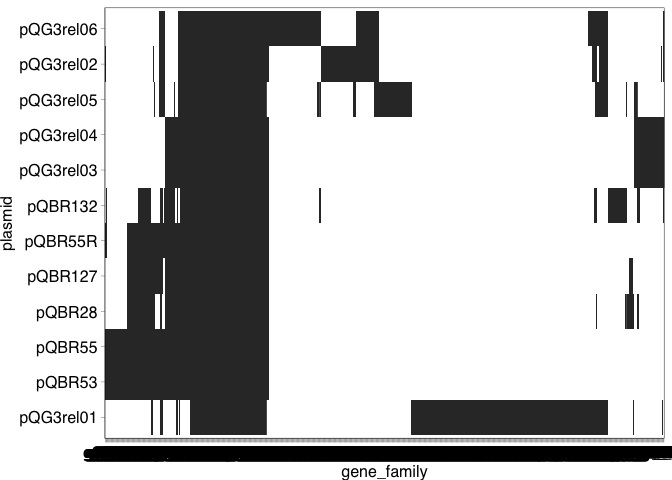<!-- -->

pQG3rel01 has a huge section absent from the other plasmids, possibly
indicating that it is a plasmid fusion. There are some other transposons
evident in the sequences, and a large conserved region.

Calculate distances within each group (raw p-distance), and aggregate.

``` bash
find ./2_pangenomes/a_group_iii_pirate_polished/feature_sequences -name "*.nucleotide.fasta" \
  | awk -v FS="/" '{print $5}' | sed 's/\.nu.*//g' | while read GROUP
  do
  megacc -a ./ref/distance_estimation_overall_mean_nucleotide_p.mao \
    -d ./2_pangenomes/a_group_iii_pirate_polished/feature_sequences/${GROUP}.nucleotide.fasta \
    -o ./2_pangenomes/a_group_iii_distances/${GROUP}
  done
  
find ./2_pangenomes/a_group_iii_distances -name "*.csv" \
  | awk -v FS="/" '{print $4}' | sed 's/\..*//g' \
  | while read GROUP
  do
  dist=`tail -n +3 ./2_pangenomes/a_group_iii_distances/${GROUP}.csv`
  echo $GROUP $dist
  done > ./2_pangenomes/a_group_iii_distances.txt
```

Pull out interesting information about these groups.

``` r
a_group_iii_distances <- read.table("./2_pangenomes/a_group_iii_distances.txt",
                                  header = FALSE, col.names=c("gene_family","dist"), sep=" ")

group_iii_pirate %>% left_join(a_group_iii_distances, by="gene_family") %>%
  filter(dist>0) %>%
  arrange(-dist) %>% 
  select(gene_family, dist, consensus_product, threshold) %>% 
  head(n = 10) %>% kable()
```

| gene_family |      dist | consensus_product                   | threshold |
|:------------|----------:|:------------------------------------|----------:|
| g0063       | 0.1358330 | Abasic site processing protein      |        90 |
| g0107       | 0.1279461 | Transcriptional regulator           |        60 |
| g0067       | 0.0970152 | thermonuclease family protein       |        80 |
| g0114       | 0.0937778 | DUF3846 domain-containing protein   |        70 |
| g0108       | 0.0719240 | Cytochrome P450                     |        70 |
| g0115       | 0.0710210 | DUF2489 domain-containing protein   |        70 |
| g0136       | 0.0677507 | Conserved hypothethical protein     |        70 |
| g0104       | 0.0673505 | Single-stranded DNA-binding protein |        70 |
| g0117       | 0.0634921 | Lipoprotein                         |        70 |
| g0089       | 0.0631229 | Alpha/beta hydrolase                |        80 |

#### Generate and visualise pangenome graph in Bandage

Follow the example above to draw a pangenome graph for Group III
plasmids.

Set the link circularising the plasmid, using pQBR55. The first gene is
pQBR55_00001, the last gene is:

``` bash
tail -n1 ./bakta_annotated/pQBR55/pQBR55.tsv

grep "PQBR55_00990" ./2_pangenomes/a_group_iii_pirate_polished/modified_gffs/pQBR55.gff
```

pQBR55_00198 (in the PIRATE output). The corresponding groups for these
genes are:

``` r
group_iii_pirate %>% filter(pQBR55 %in% c("pQBR55_00001","pQBR55_00198")) %>% 
  select(gene_family)
```

    ##   gene_family
    ## 1       g0051
    ## 2       g0056

Gene families g0051 and g0056. Add a link to the `pangenome.gfa` file.

``` bash
cp ./2_pangenomes/a_group_iii_pirate_polished/pangenome.gfa \
  ./2_pangenomes/a_group_iii_pirate_polished_pangenome.gfa
  
echo -e 'L\tg0051\t+\tg0056\t+\t0M' >> ./2_pangenomes/a_group_iii_pirate_polished_pangenome.gfa
```

Adding a label `.csv` file, as above.

``` r
a_group_iii_distances %>% ggplot(aes(x = dist)) + geom_density()
```

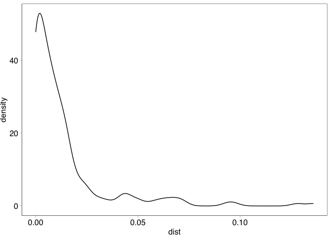<!-- -->

``` r
a_group_iii_distances %>% ggplot(aes(x = log10(dist))) + geom_density()
```

    ## Warning: Removed 48 rows containing non-finite outside the scale range
    ## (`stat_density()`).

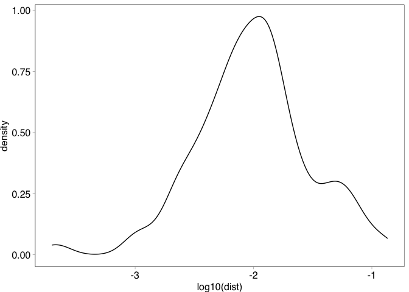<!-- -->

``` r
a_group_iii_distances %>% 
  summarise(min = min(dist),
            mean = mean(dist),
            median = median(dist),
            max = max(dist)) %>% kable()
```

| min |      mean |    median |      max |
|----:|----------:|----------:|---------:|
|   0 | 0.0132958 | 0.0068445 | 0.135833 |

Shows that in most cases, there is 0-0.1% distance within a group, with
a long tail up to ~11% distance within a group.

Use the same gradient as above.

``` r
a_group_iii_distances$hex_from_scales <- pal(a_group_iii_distances$dist)

a_group_iii_distances %>% 
  full_join(select(group_iii_pirate, gene_family, consensus_product),
            by="gene_family") %>%
  mutate(Name = gene_family, 
         Product = consensus_product,
         Colour = ifelse(is.na(hex_from_scales), "#4d4d4d", hex_from_scales)) %>%
  select(Name, Product, Colour) %>% 
  write.table(file = "./2_pangenomes/a_group_iii_pirate_polished_pangenome_cols.csv",
              sep=",", quote=FALSE, row.names=FALSE)
```

<figure>
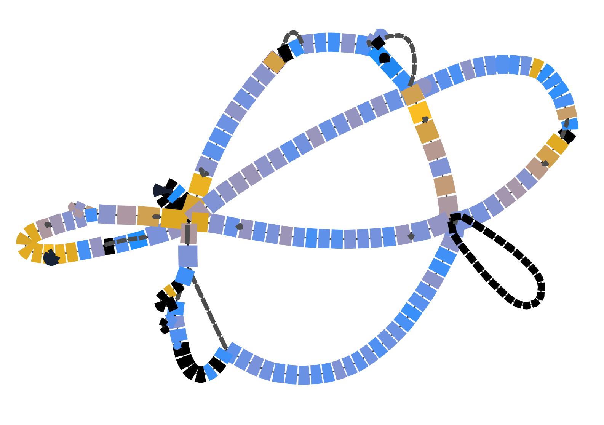
<figcaption aria-hidden="true">Group III bandage plot with
distances</figcaption>
</figure>

This information can also be presented on the heatmap, again ordered by
distance.

Reorder this by the distances within each cluster. Requires to order the
heatmap by clusters, rather than following directly the order on the
dendrogram.

``` r
giiip_gene_clusters <- cutree(giiip_genefam_dendro, h = 0)

giiip_gene_clusters_df <- data.frame(
  gene_family = names(giiip_gene_clusters),
  cluster = giiip_gene_clusters) %>% 
  left_join(a_group_iii_distances, by="gene_family")

giiip_clusters <- giiip_gene_clusters_df[order(giiip_gene_clusters_df$cluster,
                                           giiip_gene_clusters_df$dist),]

giiip_long %>% 
  left_join(a_group_iii_distances, by="gene_family") %>%
  mutate(distcol = ifelse(is.na(hex_from_scales), "#4d4d4d", hex_from_scales),
         gene_family = factor(gene_family, levels=giiip_clusters$gene_family),
         plasmid = factor(plasmid, levels=giiip_plasmid_order)) %>%
  ggplot(aes(x=gene_family, y=plasmid)) + 
  geom_tile(aes(fill=distcol)) +
  scale_fill_identity()
```

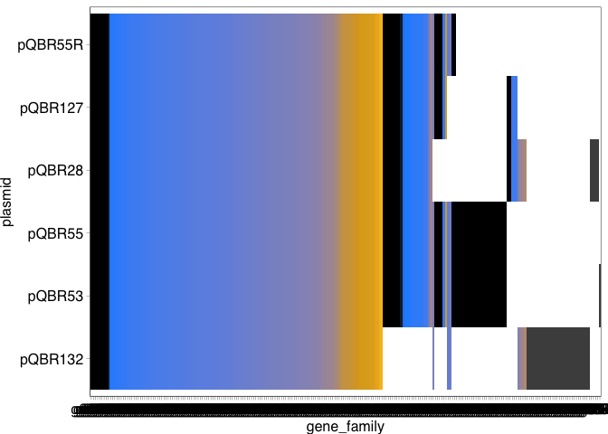<!-- -->

Next steps:

- Go through the analysis with pQBR26

### Group II plasmids

The ‘Group II’ plasmids in the collection are pQBR23, pQBR24, and
pQBR26. However, as described in [the assembly](1_Assembly.md), pQBR26
seems to harbour both a pQBR23-like plasmid, and a plasmid that is more
divergent. It is this latter plasmid that is seemingly mobile from the
pQBR26 strain. Therefore, there are two different types of Group II
plasmid, which have some distant similarities.

Focus first on the pQBR26 type, which we will call Group IIb.

#### Identify similar plasmids to pQBR26 from databases using MASH

Note that pQBR26 does not appear to have the Tn5042 transposon sequence.
The same is true for pQBR23/pQBR24.

Try running the whole sequence against the databases, as above.

``` bash
mash sketch -s 10000 ./bakta_annotated/pQBR26/pQBR26.fna \
  -o ./MASH_sketches/pQBR26.msh

mash dist -p 64 \
  ./MASH_sketches/pQBR26.msh \
  ../MASH_DBS/refseq.genomes+plasmid.k21s1000.msh \
  > ./MASH_sketches/pQBR26_refseq_mash_results.txt

mash dist -p 64 \
  ./MASH_sketches/pQBR26.msh \
  ../MASH_DBS/pseudomonas_complete.fasta.msh \
  > ./MASH_sketches/pQBR26_ps_comp_mash_results.txt

mash dist -p 64 \
  ./MASH_sketches/pQBR26.msh \
  ../MASH_DBS/pseudomonas_draft.fasta.msh \
  > ./MASH_sketches/pQBR26_ps_draft_mash_results.txt

mash dist -p 64 \
  ./MASH_sketches/pQBR26.msh \
  ../MASH_DBS/plsdb.fasta.msh \
  > ./MASH_sketches/pQBR26_plsdb_mash_results.txt
```

There are lots of matches in both databases — much more than for the
other pQBR plasmids. However, these may not be full-length matches,
since pQBR26 does harbour transposons which were not removed before
comparison.

``` bash
awk '$4 < 1e-100 {print $2}' ./2_sketches/pQBR26_ps_draft_mash_results.txt | wc -l # 7701 matches
awk '$4 < 1e-100 {print $2}' ./2_sketches/pQBR26_ps_comp_mash_results.txt | wc -l # 148 matches
awk '$4 < 1e-100 {print $2}' ./2_sketches/pQBR26_plsdb_mash_results.txt | wc -l # 3398 matches
```

Look at the top matches from PLSDB.

``` bash
awk '$4 < 1e-100 {print $0}' ./2_sketches/pQBR26_plsdb_mash_results.txt | sort -gk3 | head -n 20
```

These appear to be IncP-MOBH-MPF_F plasmids. Looking at some of these in
more detail, we can see blocks of synteny and regions of divergence
similar to that observed with the other groups.

As there is only one pQBR26 representative in our dataset, a full
pangenomic analysis of related plasmids is beyond the scope of the
current study.

#### Identify similar plasmids to pQBR23 from databases using MASH

``` bash
mash sketch -s 10000 ./bakta_annotated/pQBR23/pQBR23.fna \
  -o ./MASH_sketches/pQBR23.msh

mash dist -p 64 \
  ./MASH_sketches/pQBR23.msh \
  ../MASH_DBS/refseq.genomes+plasmid.k21s1000.msh \
  > ./MASH_sketches/pQBR23_refseq_mash_results.txt

mash dist -p 64 \
  ./MASH_sketches/pQBR23.msh \
  ../MASH_DBS/pseudomonas_complete.fasta.msh \
  > ./MASH_sketches/pQBR23_ps_comp_mash_results.txt

mash dist -p 64 \
  ./MASH_sketches/pQBR23.msh \
  ../MASH_DBS/pseudomonas_draft.fasta.msh \
  > ./MASH_sketches/pQBR23_ps_draft_mash_results.txt

mash dist -p 64 \
  ./MASH_sketches/pQBR23.msh \
  ../MASH_DBS/plsdb.fasta.msh \
  > ./MASH_sketches/pQBR23_plsdb_mash_results.txt
```

There are lots of matches in both databases — even compared with pQBR26!

``` bash
awk '$4 < 1e-100 {print $2}' ./2_sketches/pQBR23_ps_draft_mash_results.txt | wc -l # 10882 matches
awk '$4 < 1e-100 {print $2}' ./2_sketches/pQBR23_ps_comp_mash_results.txt | wc -l # 211 matches
awk '$4 < 1e-100 {print $2}' ./2_sketches/pQBR23_plsdb_mash_results.txt | wc -l # 5807 matches
```

Look at the top matches from PLSDB.

``` bash
awk '$4 < 1e-100 {print $0}' ./2_sketches/pQBR23_plsdb_mash_results.txt | sort -gk3 | head -n 20
```

These appear to be MOBF-MPF_F plasmids. Again, it is beyond the scope of
the current study to explore these in further detail.

------------------------------------------------------------------------

**[Back to index.](../README.md)**
